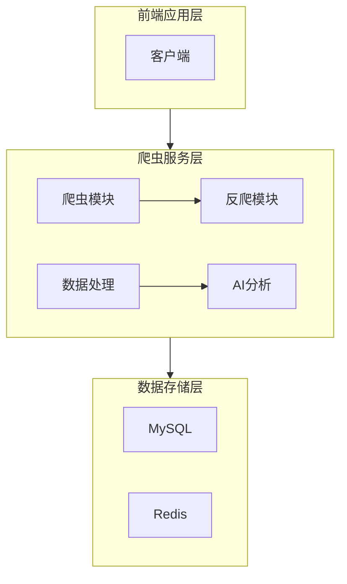

# BossAnalyze 爬虫系统

## 1. 技术架构

### 整体架构图

### 技术栈选型

#### 后端技术栈
- **基础框架**: Spring Boot (JDK 17)
- **ORM框架**: MyBatis-Plus
- **数据库**: MySQL
- **缓存**: Redis
- **爬虫相关**:
  - Selenium + ChromeDriver
  - Playwright
  - Jsoup
  - HttpClient
- **消息队列**: Kafka
- **AI模型调用**: Spring AI (Ollama 接口)

#### 数据库
- MySQL: 存储结构化数据
- Redis: 缓存和分布式锁

### 系统模块划分

1. **爬虫核心模块**
   - WebCrawlerService: 负责网页抓取和浏览器自动化
   - HtmlParserService: 解析HTML内容
   - DataScrapingService: 提取和清洗数据

2. **调度模块**
   - StartScheduled: 定时任务管理

3. **数据处理模块**
   - JsonScrapingService: JSON数据处理

4. **AI分析模块**
   - 使用Spring AI连接Ollama模型进行数据分析

5. **反爬处理模块**
   - IP封锁检测
   - 验证码处理
   - 随机延时

## 2. 核心技术实现

### 关键功能技术方案

#### 智能爬虫实现
- **多重爬虫技术**: 结合Selenium、Playwright和Jsoup多种爬虫技术，应对不同场景
- **Cookie管理**: 通过WebDriver获取并应用Cookie，维持会话状态
- **自动化验证**: 自动检测并处理验证码页面
- **IP封锁检测**: 实时监测IP是否被封，及时调整策略

#### 数据提取与解析
- 使用Jsoup进行HTML解析
- 使用正则表达式和DOM操作提取目标数据
- 支持复杂网页结构的数据提取

#### AI辅助分析
- 对接Ollama AI模型
- 自动分析职位描述和要求
- 提取关键技能和薪资信息
- 生成结构化数据供后续分析

### 数据处理流程

1. **数据采集阶段**
   - 使用WebCrawlerService获取目标页面
   - 处理各种异常情况（验证码、IP封锁等）
   - 存储原始HTML数据

2. **数据解析阶段**
   - 使用HtmlParserService解析HTML结构
   - 提取目标数据（职位、公司、薪资等）
   - 初步清洗和格式化数据

3. **数据存储阶段**
   - 将结构化数据存入MySQL
   - 使用Redis缓存热点数据

4. **数据分析阶段**
   - 使用AI模型分析职位描述
   - 提取关键词和技能要求
   - 生成分析报告

### 性能优化策略

1. **并发控制**
   - 使用线程池管理爬虫任务
   - 控制爬取频率避免IP封锁

2. **资源管理**
   - WebDriver资源池化管理
   - 及时释放浏览器资源

3. **缓存策略**
   - 使用Redis缓存热点数据
   - 减少重复爬取和解析

4. **失败重试机制**
   - 智能检测失败原因
   - 根据不同情况采用不同重试策略

5. **定时任务优化**
   - 错峰调度爬虫任务
   - 根据目标网站流量动态调整爬取策略
