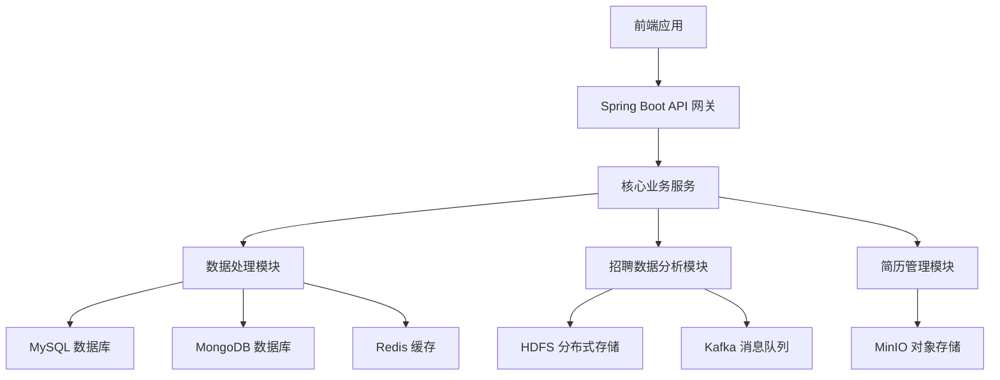
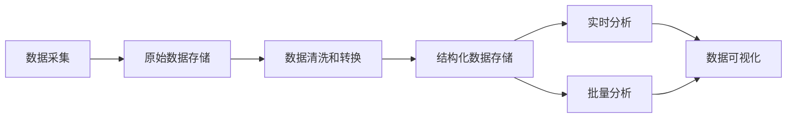

# BossAnalyze - 招聘数据分析系统

## 1. 技术架构

### 1.1 整体架构图

### 1.2 技术栈选型

#### 1.2.1 后端技术栈

- **核心框架**: Spring Boot 3.x (基于 JDK 17)
- **ORM 层**:
  - MyBatis-Plus (SQL 映射和增强)
  - Spring Data JPA (对象关系映射)
- **数据库**:
  - MySQL (关系型数据)
  - MongoDB (非结构化数据)
  - Redis (缓存和会话管理)
- **安全框架**: Spring Security + JWT
- **API 文档**: SpringDoc OpenAPI (Swagger)
- **大数据处理**:
  - Apache Hadoop 生态系统 (HDFS, MapReduce)
  - Apache Kafka (消息队列)
- **对象存储**: MinIO
- **Web 抓取与自动化**:
  - Selenium
  - Playwright
  - JSoup
- **日志管理**: Logback + SLF4J

#### 1.2.2 前端技术栈

- 前端框架待定 (可能是 React/Vue/Angular)
- 数据可视化库 (用于招聘数据分析图表展示)

#### 1.2.3 DevOps 工具

- Maven (构建工具)
- Git (版本控制)
- Docker (容器化)

### 1.3 系统模块划分

- **系统管理模块** (`system`): 用户权限、系统配置等
- **通用功能模块** (`common`): 工具类、通用响应处理等
- **Boss 招聘数据分析模块** (`boss`):
  - 招聘数据分析控制器
  - 招聘信息数据模型
- **简历管理模块** (`resume`):
  - 简历解析
  - 简历存储与检索
- **分布式存储模块**:
  - HDFS 集成 (`hdfs`)
  - MinIO 对象存储 (`minio`)
- **消息队列模块**:
  - Kafka 集成 (`kafka`)
  - 通用消息队列服务 (`mq`)
- **AI 辅助模块** (`ai`): 智能分析与推荐
- **日志管理模块** (`log`): 系统日志记录与查询

## 2. 核心技术实现

### 2.1 关键功能技术方案

#### 2.1.1 招聘数据分析系统

- **数据采集**: 使用 Selenium/Playwright 进行招聘网站数据爬取
- **数据存储**: 原始数据存储在 MongoDB，处理后的结构化数据存入 MySQL
- **数据分析**:
  - 薪资热门职位分析
  - 二维和三维图表分析（城市、职位、薪资、学历等多维度）
  - 招聘趋势分析

#### 2.1.2 简历管理系统

- 支持多格式简历解析（PDF、Word 等）
- 简历信息结构化存储
- 简历与职位匹配度分析

#### 2.1.3 分布式存储与处理

- 大文件和非结构化数据使用 HDFS/MinIO 存储
- 使用 MapReduce 进行大规模数据处理
- Kafka 实现数据采集与处理的解耦和异步处理

### 2.2 数据处理流程

1. **数据采集层**: 通过 Web 爬虫从招聘网站获取数据
2. **原始数据存储**: 使用 MongoDB 存储爬取的原始 JSON 数据
3. **数据处理层**:
   - 数据清洗（去重、修正）
   - 数据转换（标准化、结构化）
4. **结构化存储层**: 处理后的数据存入 MySQL 关系型数据库
5. **分析层**:
   - 实时分析：直接查询处理
   - 批量分析：使用 Hadoop MapReduce 进行大规模数据计算
6. **展示层**: 通过 API 提供数据，前端进行可视化展示

### 2.3 性能优化策略

#### 2.3.1 数据库优化

- Redis 缓存热点数据，减轻数据库压力
- MySQL 索引优化
- MongoDB 查询优化

#### 2.3.2 API 性能优化

- 合理使用 Spring Boot Actuator 监控系统性能
- API 接口缓存策略
- 分页查询优化

#### 2.3.3 大数据处理优化

- Hadoop 分布式计算优化
- Kafka 消息处理的并行化和批量处理

#### 2.3.4 系统高可用性

- 服务无状态化，便于水平扩展
- 合理的限流和熔断策略
- 分布式日志收集与监控

---

该项目是一个基于 Spring Boot 的招聘数据分析系统，旨在通过大数据技术对招聘市场进行多维度分析，为求职者和 HR 提供决策支持。
