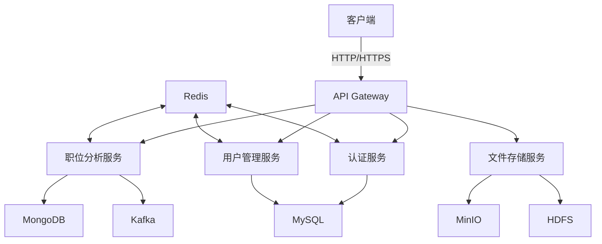

# BossAnalyze 后端服务

## 📖 项目概述

BossAnalyze 是一个基于 Spring Boot 的招聘数据分析平台后端服务，提供了职位数据分析、用户认证授权、文件存储等功能。项目采用现代化的技术栈和架构设计，支持高并发、分布式部署。

## 🚀 技术栈

### 核心框架
- **Spring Boot 3.x** - 应用框架
- **Spring Security** - 认证和授权
- **Spring Data JPA** - 数据持久化
- **MyBatis-Plus** - MyBatis增强工具
- **Spring Data MongoDB** - NoSQL数据库访问

### 数据库
- **MySQL** - 关系型数据库
- **MongoDB** - 文档数据库
- **Redis** - 缓存和会话管理

### 存储
- **MinIO** - 对象存储服务
- **HDFS** - 分布式文件系统

### 消息队列
- **Kafka** - 消息队列

### 其他
- **JWT** - 认证令牌
- **Swagger/OpenAPI** - API文档
- **Lombok** - 简化代码
- **WebDriver/Playwright** - 网页自动化

## 🏗️ 系统架构



## 📂 项目结构

```
src/main/java/com/david/hlp/web/
├── ai/                    # AI相关功能
│   ├── controller/        # 控制器
│   ├── model/             # 数据模型
│   └── service/           # 服务层
├── boss/                  # Boss直聘数据相关
│   ├── controller/        # 控制器
│   └── model/             # 数据模型
├── common/                # 通用模块
│   ├── config/            # 配置类
│   ├── controller/        # 基础控制器
│   ├── enums/             # 枚举类
│   ├── exception/         # 异常处理
│   ├── result/            # 统一返回结果
│   └── util/              # 工具类
├── hdfs/                  # HDFS集成
│   ├── config/            # 配置类
│   └── utils/             # 工具类
├── kafka/                 # Kafka集成
│   ├── model/             # 数据模型
│   └── service/           # 服务层
├── minio/                 # MinIO集成
│   ├── config/            # 配置类
│   ├── controller/        # 控制器
│   ├── model/             # 数据模型
│   └── service/           # 服务层
├── resume/                # 简历管理
│   ├── Repository/        # 数据访问层
│   ├── config/            # 配置类
│   ├── controller/        # 控制器
│   ├── entity/            # 实体类
│   └── service/          # 服务层
└── system/                # 系统管理
    ├── auth/             # 认证授权
    ├── config/           # 配置类
    ├── controller/       # 控制器
    └── entity/          # 实体类
```

## 🔍 功能模块

### 1. 用户认证与授权
- JWT 认证
- 基于角色的访问控制 (RBAC)
- 权限管理
- 会话管理

### 2. 职位分析
- 薪资热点职位分析
- 二维分析图表
- 三维分析图表
- 职位数据统计

### 3. 文件管理
- 文件上传下载
- 图片处理
- 大文件分片上传
- 文件权限控制

### 4. 简历管理
- 简历解析
- 简历存储
- 简历搜索
- 简历分析

### 5. 系统管理
- 用户管理
- 角色管理
- 权限管理
- 系统监控

## 📡 API 文档

项目集成了 Swagger/OpenAPI，启动服务后访问：

```
http://localhost:8080/swagger-ui.html
```

### 主要API端点

#### 认证相关
- `POST /api/auth/demo/register` - 用户注册
- `POST /api/auth/demo/login` - 用户登录
- `GET /api/auth/demo/getRouters` - 获取路由信息

#### 职位分析
- `GET /api/boss/user/salary-hot-job` - 获取薪资热点职位
- `GET /api/boss/user/two-dimensional-analysis-chart` - 获取二维分析图表数据
- `GET /api/boss/user/three-dimensional-analysis-chart` - 获取三维分析图表数据

#### 文件管理
- `POST /api/minio/upload` - 文件上传
- `GET /api/minio/download/{objectName}` - 文件下载
- `DELETE /api/minio/delete/{objectName}` - 删除文件

## 🚀 快速开始

### 环境要求
- JDK 17+
- Maven 3.6+
- MySQL 8.0+
- MongoDB 4.4+
- Redis 6.0+
- MinIO (可选)
- Kafka (可选)

### 配置

1. 复制 `application.yml` 为 `application-dev.yml`
2. 根据实际环境修改数据库连接信息
3. 配置 Redis 连接信息
4. 配置 MinIO 连接信息 (如使用)
5. 配置 Kafka 连接信息 (如使用)

### 启动应用

```bash
# 克隆项目
git clone <repository-url>

# 进入项目目录
cd JDK17SERVE/spring

# 编译项目
mvn clean package

# 运行应用
java -jar target/spring-web-0.0.1-SNAPSHOT.jar
```

## 🔧 开发指南

### 代码规范
- 遵循阿里巴巴Java开发手册
- 使用Lombok简化代码
- 统一使用Swagger注解编写API文档

### 分支管理
- `main` - 主分支，用于生产环境部署
- `dev` - 开发分支，用于日常开发
- `feature/*` - 功能开发分支
- `bugfix/*` - Bug修复分支

### 提交规范

```
<type>(<scope>): <subject>

<body>

<footer>
```

**类型(type)**
- feat: 新功能
- fix: 修复bug
- docs: 文档更新
- style: 代码格式调整
- refactor: 代码重构
- test: 测试用例
- chore: 构建过程或辅助工具的变动

## 📦 部署

### Docker 部署

```bash
# 构建Docker镜像
docker build -t boss-analyze-spring .

# 运行容器
docker run -d -p 8080:8080 --name boss-analyze-spring boss-analyze-spring
```

### Kubernetes 部署

```yaml
apiVersion: apps/v1
kind: Deployment
metadata:
  name: boss-analyze-spring
spec:
  replicas: 3
  selector:
    matchLabels:
      app: boss-analyze-spring
  template:
    metadata:
      labels:
        app: boss-analyze-spring
    spec:
      containers:
      - name: boss-analyze-spring
        image: boss-analyze-spring:latest
        ports:
        - containerPort: 8080
        env:
        - name: SPRING_PROFILES_ACTIVE
          value: "prod"
---
apiVersion: v1
kind: Service
metadata:
  name: boss-analyze-spring
spec:
  selector:
    app: boss-analyze-spring
  ports:
  - protocol: TCP
    port: 80
    targetPort: 8080
  type: LoadBalancer
```

## 📊 监控

项目集成了 Spring Boot Actuator，可以通过以下端点进行监控：

- `/actuator/health` - 应用健康状态
- `/actuator/info` - 应用信息
- `/actuator/metrics` - 应用指标
- `/actuator/env` - 环境变量

## 🤝 贡献指南

1. Fork 项目
2. 创建您的特性分支 (`git checkout -b feature/AmazingFeature`)
3. 提交您的更改 (`git commit -m 'Add some AmazingFeature'`)
4. 推送到分支 (`git push origin feature/AmazingFeature`)
5. 开启一个 Pull Request

## 📄 许可证

[MIT](LICENSE) © DavidHLP

---

<div align="center">
  <sub>Built with ❤️ by <a href="https://github.com/DavidHLP">DavidHLP</a></sub>
</div>