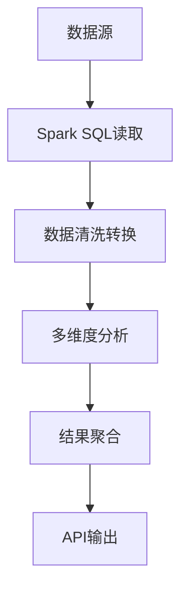

# Boss招聘数据分析平台 - Spark服务

## 项目概述

这是一个基于Apache Spark的招聘数据分析平台，专注于处理和分析Boss直聘的招聘数据。项目采用Spring Boot框架集成Spark，提供高效的数据处理和分析能力，支持多维度数据分析和可视化。

## 功能特点

- **多维度数据分析**：支持薪资、学历、工作经验等多维度数据分析
- **实时计算**：基于Spark SQL实现高效数据计算
- **RESTful API**：提供标准化的数据接口
- **分布式处理**：支持海量数据处理
- **数据可视化**：为前端提供标准化数据格式，支持多种可视化展示

## 技术栈

- **核心框架**：Spring Boot 2.7.x
- **大数据处理**：Apache Spark 3.x
- **数据存储**：MySQL 8.0
- **构建工具**：Maven
- **开发语言**：Java 8
- **API文档**：Spring Web MVC

## API接口

### 1. 基础数据接口

#### 获取城市列表
```
GET /api/v1/boss/basic/city-name-list
```

#### 获取职位列表
```
GET /api/v1/boss/basic/position-name-list?cityName=城市名称
```

### 2. 数据分析接口

#### 获取高薪职位排行
```
GET /api/v1/boss/user/salary-hot-job?limit=10
```

#### 获取二维分析数据
```
GET /api/v1/boss/user/two-dimensional-analysis-chart?cityName=all&positionName=all&xAxis=salary_value&yAxis=degree_value
```

#### 获取三维分析数据
```
GET /api/v1/boss/user/three-dimensional-analysis-chart?cityName=all&positionName=all
```

## 快速开始

### 环境要求

- JDK 8
- Maven 3.6+
- MySQL 8.0+
- Spark 3.2.0+

### 数据库配置

1. 创建数据库：
```sql
CREATE DATABASE IF NOT EXISTS boss_data CHARACTER SET utf8mb4 COLLATE utf8mb4_unicode_ci;
```

2. 导入数据表结构（参考项目中的SQL脚本）

### 应用配置

修改`application.yml`中的数据库连接信息：

```yaml
spring:
  datasource:
    url: jdbc:mysql://localhost:3306/boss_data?useSSL=false&characterEncoding=UTF-8
    username: root
    password: your_password
```

### 启动应用

```bash
mvn spring-boot:run
```

## 项目结构

```
src/main/java/com/david/hlp/spark/
├── config/           # 配置类
├── controller/       # 控制器层
│   └── User/         # 用户相关接口
├── enums/            # 枚举类
├── mapper/           # 数据访问层
├── model/            # 数据模型
│   └── User/         # 用户相关模型
├── service/          # 服务层
│   └── User/         # 用户相关服务
└── utils/            # 工具类
```

## 数据处理流程



## 开发指南

### 1. 添加新的分析维度

1. 在`model/User`包下创建对应的数据模型
2. 在`service/User`包下实现分析逻辑
3. 在`controller/User`包下添加API接口

### 2. 性能优化建议

- 合理使用Spark的缓存机制
- 避免数据倾斜
- 优化SQL查询
- 合理设置并行度

## 常见问题

### 1. 如何添加新的数据源？

1. 在`application.yml`中配置新的数据源
2. 使用`SparkSession`读取数据源
3. 实现对应的数据处理逻辑

### 2. 如何提高查询性能？

- 对常用查询字段建立索引
- 合理使用分区表
- 优化Spark SQL查询计划

### 3. 如何处理大数据量？

- 使用Spark的分布式计算能力
- 合理设置并行度
- 使用广播变量优化join操作

## 贡献指南

1. Fork 项目
2. 创建特性分支 (`git checkout -b feature/amazing-feature`)
3. 提交更改 (`git commit -m 'Add some amazing feature'`)
4. 推送到分支 (`git push origin feature/amazing-feature`)
5. 提交 Pull Request

## 许可证

[MIT](LICENSE)