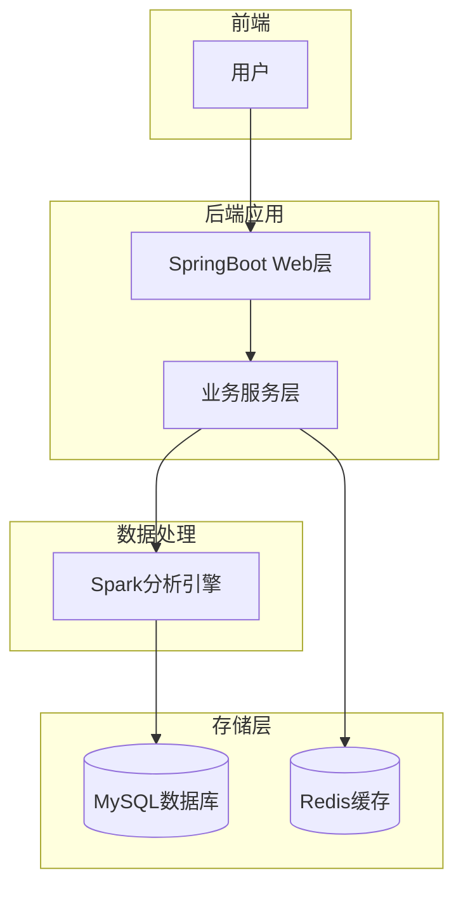
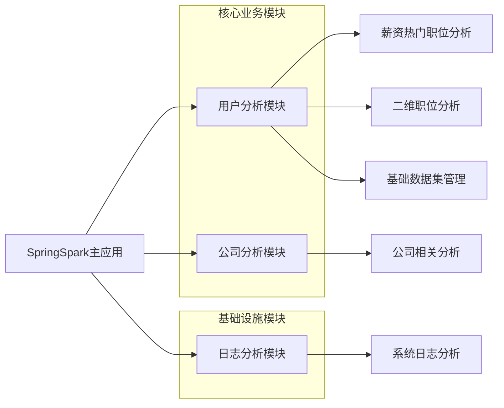
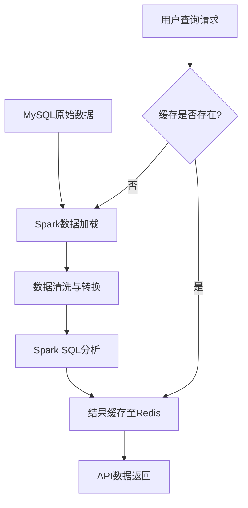

# BossAnalyze - 职位分析系统

## 1. 技术架构

### 1.1 整体架构图



### 1.2 技术栈选型

#### 后端技术栈

- **核心框架**：Spring Boot 2.x
- **数据分析引擎**：Apache Spark
- **缓存**：Redis
- **数据库**：MySQL
- **构建工具**：Maven

#### 数据处理技术栈

- **分布式计算**：Apache Spark Core、Spark SQL
- **流处理**：Spark Streaming
- **数据连接器**：Spark SQL Kafka

#### 开发工具与环境

- **JDK 版本**：JDK 8
- **项目管理**：Maven
- **API 测试**：Postman
- **版本控制**：Git

### 1.3 系统模块划分



## 2. 核心技术实现

### 2.1 关键功能技术方案

#### 2.1.1 Spark 与 Spring Boot 集成

系统通过自定义配置类（SparkLocalConfig/SparkClusterConfig）将 Spark 引擎与 Spring Boot 框架无缝集成，提供：

- 本地模式开发支持
- 集群模式部署能力
- 依赖注入式 Spark 组件调用

```java
@Configuration
public class SparkLocalConfig {
    @Bean
    public SparkSession sparkSession() {
        return SparkSession
                .builder()
                .config(sparkConf())
                .getOrCreate();
    }
}
```

#### 2.1.2 高薪职位分析

系统利用 Spark SQL 进行复杂数据分析，支持：

- 基于大数据集的职位薪资统计
- 城市维度的职位推荐
- 多维度交叉分析

#### 2.1.3 二维职位分析图表

通过 Spark 对职位数据进行多维度分析，实现：

- 薪资与学历的相关性分析
- 城市与职位的交叉分析
- 自定义维度的数据查询

### 2.2 数据处理流程



1. **数据采集与存储**：职位数据存储在 MySQL 数据库中
2. **数据加载**：通过 Spark JDBC 连接器从 MySQL 加载数据
3. **数据转换**：使用 Spark DataFrame API 进行数据清洗和结构转换
4. **数据分析**：应用 Spark SQL 进行复杂查询和聚合计算
5. **结果缓存**：分析结果存入 Redis 以提高查询性能
6. **数据展示**：通过 REST API 将结果返回给前端

### 2.3 性能优化策略

#### 2.3.1 Spark 引擎优化

- 数据集缓存：对频繁使用的 DataFrame 执行 cache()操作
- 分区优化：根据数据规模自动调整分区数量
- 内存管理：合理配置 Spark executor 内存

#### 2.3.2 查询性能优化

- Redis 缓存：热点数据缓存，减少重复计算
- 延迟加载：按需启动 Spark 分析任务
- 结果预计算：定时任务预计算常用分析结果

#### 2.3.3 系统配置优化

- 连接池管理：Redis 和 MySQL 连接池优化
- 日志分级：针对性配置不同级别的日志输出
- 资源隔离：为 Spark 任务分配独立资源

## 3. 部署与运行

### 3.1 环境要求

- JDK 8+
- Maven 3.6+
- Redis 6.0+
- MySQL 5.7+