# BossAnalyze - BOSS 直聘数据分析系统

## 📋 目录

- [📌 项目概述](#-项目概述)
- [🏗️ 系统架构](#-系统架构)
- [🔄 数据流程](#-数据流程)
- [💾 数据模型设计](#-数据模型设计)
- [🔧 技术栈详解](#-技术栈详解)
- [📊 核心功能模块](#-核心功能模块)
- [📈 数据分析能力](#-数据分析能力)
- [🎯 应用场景](#-应用场景)
- [🚀 系统部署](#-系统部署)
- [🔮 未来规划](#-未来规划)
- [👥 贡献指南](#-贡献指南)
- [📜 许可证](#-许可证)
- [📞 联系方式](#-联系方式)

## 📚 在线文档

### 快速访问

🔗 [完整文档](https://deepwiki.com/DavidHLP/BossAnalyze)

### 文档概览

> 📖 **文档包含以下主要内容：**
> - 详细的系统架构说明
> - 完整的API接口文档
> - 部署和配置指南
> - 常见问题解答
> - 开发者指南

💡 **提示：** 建议访问在线文档以获取最新的文档内容和完整的交互体验。

## 📌 项目概述

BossAnalyze 是一个全面的 BOSS 直聘数据分析系统，旨在收集、处理和可视化 BOSS 直聘平台上的招聘数据，为求职者和 HR 提供数据洞察和决策支持。系统采用分布式架构，集成了爬虫、数据处理、数据分析和可视化展示功能，帮助用户了解不同城市、不同职位的薪资水平、职位需求、公司分布等关键信息。

### ✨ 主要特点

| 特点                  | 描述                                                 |
| --------------------- | ---------------------------------------------------- |
| 🔍 **智能数据采集**   | 自动爬取 BOSS 直聘招聘信息，支持多线程并发和反爬策略 |
| 🧹 **高效数据处理**   | 大规模数据清洗和分析，基于 Spark 的分布式处理        |
| 📊 **丰富数据可视化** | 提供薪资热力图、职位需求趋势图等多种可视化展示       |
| 🔐 **完善用户管理**   | 基于 RBAC 的权限控制，保障数据安全                   |
| ⚡ **快速测试原型**   | Python 模块支持快速原型验证和即时分析                |

### 👥 目标用户

- **求职者**：了解市场薪资水平和职位需求
- **企业 HR**：制定合理的薪资策略和招聘计划
- **教育培训机构**：优化课程设置和职业规划
- **政策研究机构**：为政策制定提供数据支持

## 🏗️ 系统架构

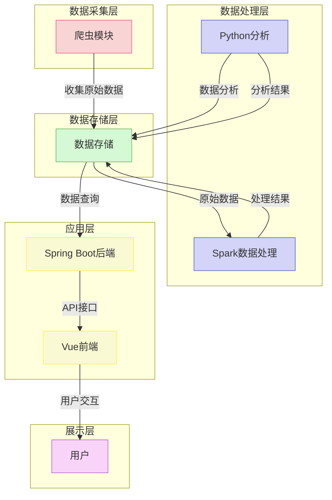

### 📦 核心模块

| 模块            | 功能描述                                                                                                            |
| --------------- | ------------------------------------------------------------------------------------------------------------------- |
| 🕸️ **爬虫模块** | 负责从 BOSS 直聘网站爬取招聘数据，包括职位信息、薪资、公司详情等                                                    |
| 💾 **数据存储** | 基于 MySQL 的数据存储系统，分为 Boss 数据库和系统管理数据库                                                         |
| 🔄 **数据处理** | • Spark 模块：处理大规模数据，进行数据清洗、转换和分析 • Python 快速测试模块：提供快速数据分析能力，用于原型验证 |
| 🌐 **后端 API** | 基于 Spring Boot 的后端服务，提供 RESTful API 接口                                                                  |
| 📱 **前端界面** | 基于 Vue.js 的现代化响应式前端，展示数据分析结果和可视化图表                                                        |

## 🔄 数据流程

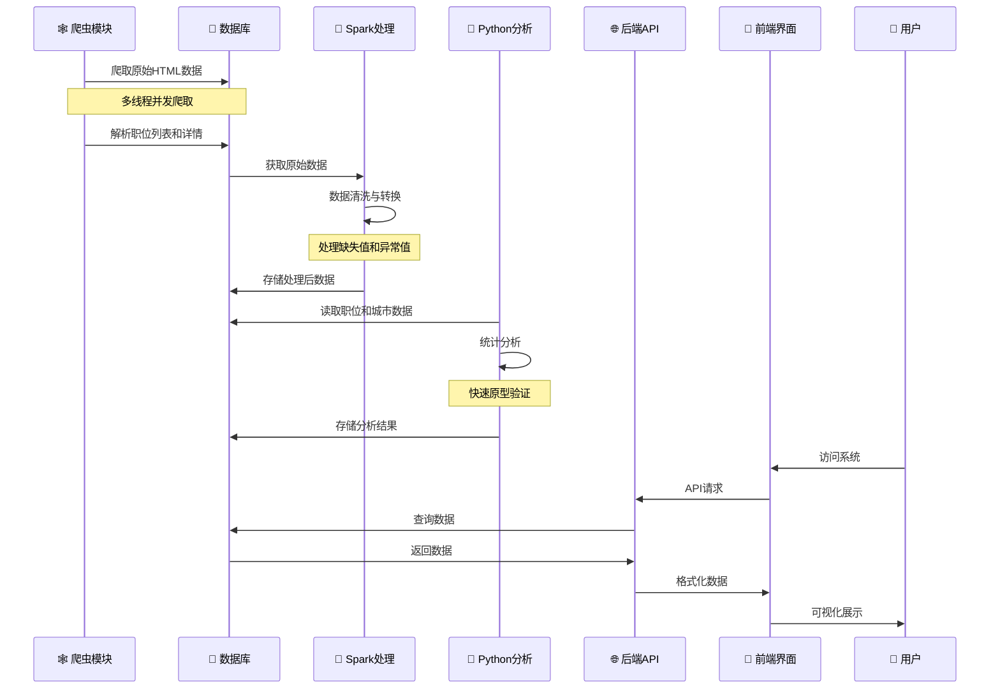

## 💾 数据模型设计

### 📊 BOSS 数据库模型

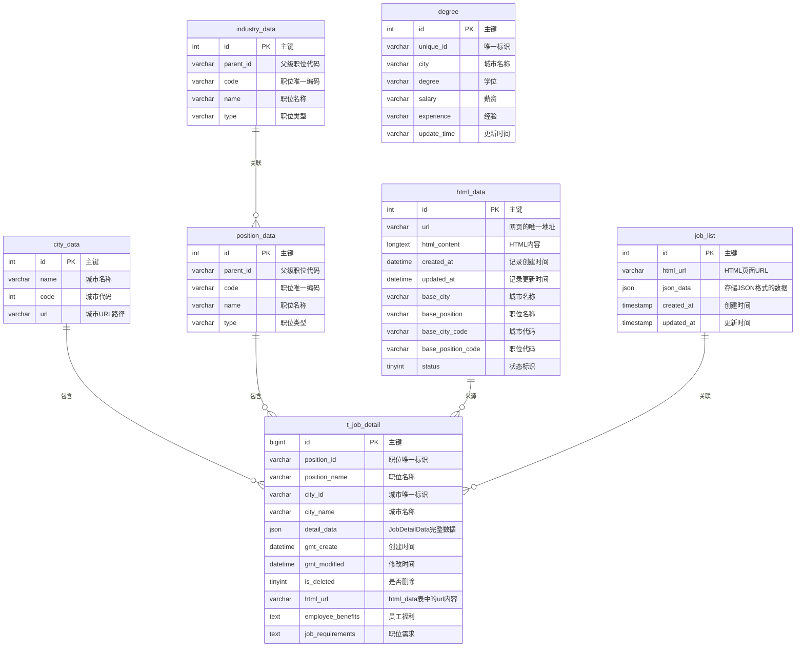

### 🔐 系统管理数据库模型

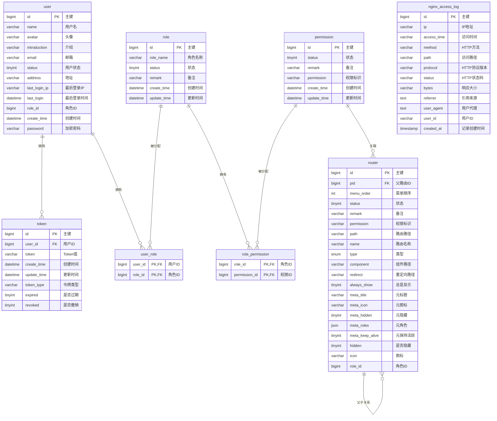

## 🔧 技术栈详解

### 🌈 前端技术栈

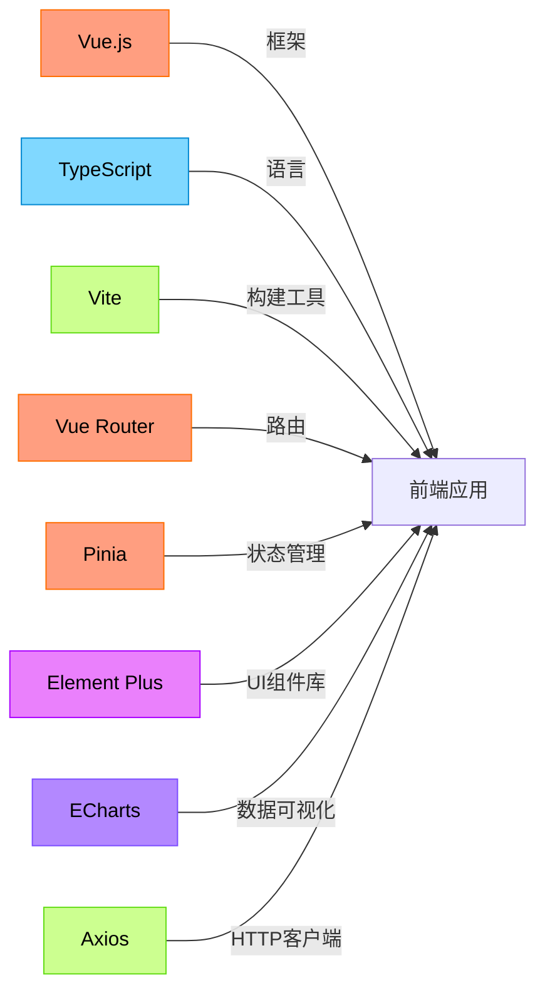

### 🏢 后端技术栈

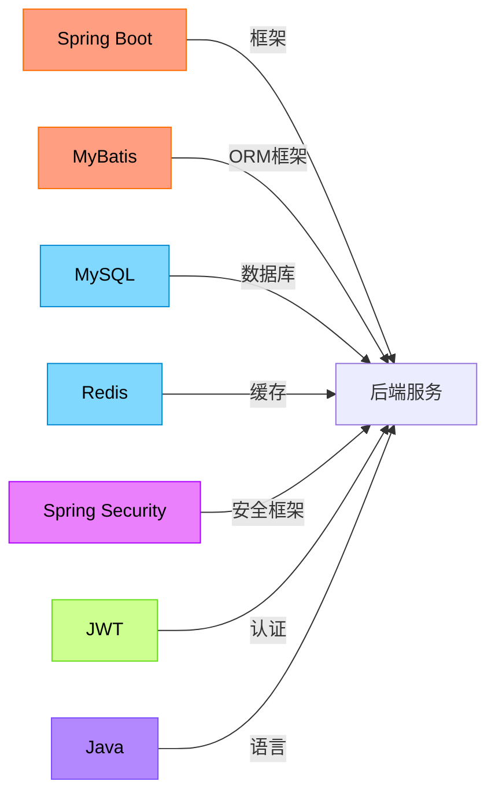

### 🕸️ 爬虫技术栈

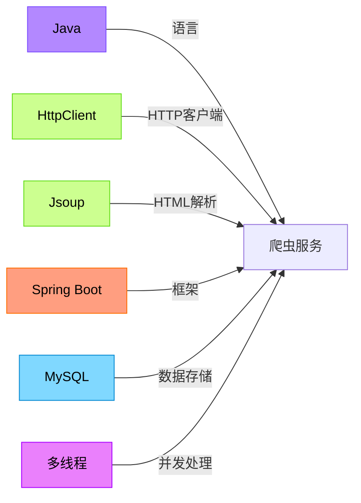

### 📊 数据处理技术栈

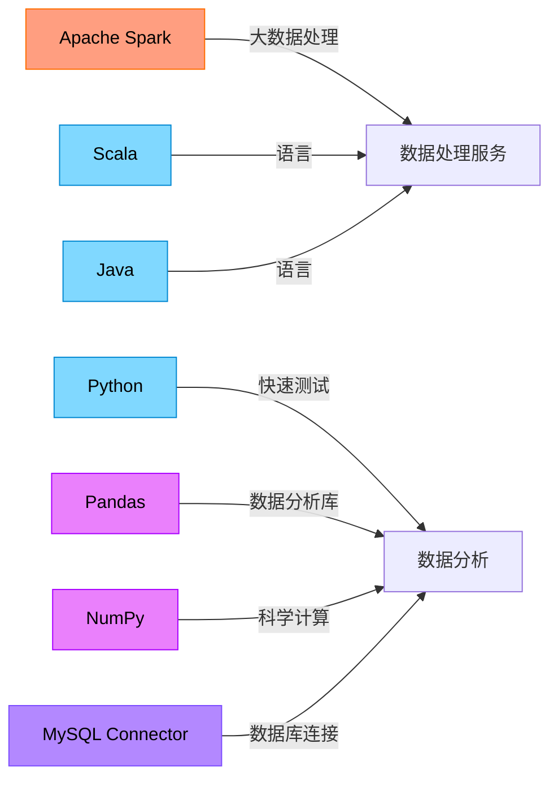

## 📊 核心功能模块

### 🕸️ 数据采集模块

数据采集模块主要负责从 BOSS 直聘网站爬取招聘信息，包括但不限于以下数据：

- 职位基本信息：职位名称、薪资范围、工作地点
- 职位详细要求：学历要求、经验要求、技能要求
- 公司信息：公司名称、公司规模、融资阶段、所属行业

爬虫采用分布式架构，支持多线程并发爬取，同时实现了 IP 代理池、请求频率控制等反爬机制，确保数据采集的稳定性和可靠性。

### 🔄 数据处理模块

数据处理模块基于 Apache Spark 和 Python 实现，主要功能包括：

#### Spark 大数据处理

- **数据清洗**：处理缺失值、异常值，标准化数据格式
- **数据转换**：将非结构化数据转换为结构化数据，如薪资范围转换为数值
- **数据聚合**：按城市、职位、行业等维度聚合数据
- **统计分析**：计算平均薪资、职位分布、技能需求热度等指标

#### Python 快速测试模块

- **城市数据分析**：获取城市列表、统计城市工作数量
- **职位薪资分析**：计算不同职位的薪资范围和推荐城市
- **二维数据分析**：将薪资、学历、经验等数据进行转换，用于图表展示
- **快速统计报表**：生成即时分析结果，支持快速原型验证

### 📈 数据可视化模块

数据可视化模块基于 Vue.js 和 ECharts 实现，提供丰富的图表展示：

| 图表类型              | 展示内容                     | 应用场景                 |
| --------------------- | ---------------------------- | ------------------------ |
| 🌡️ **薪资热力图**     | 不同城市、不同职位的薪资水平 | 求职者了解各地区薪资情况 |
| 📈 **职位需求趋势图** | 职位需求随时间的变化趋势     | HR 分析人才市场变化      |
| 🎯 **技能需求雷达图** | 不同职位所需技能的分布情况   | 求职者了解技能提升方向   |
| 🗺️ **公司分布地图**   | 招聘公司的地理分布情况       | 求职者了解就业机会分布   |

### 👤 用户管理模块

用户管理模块基于 Spring Security 和 JWT 实现，提供安全的用户认证和授权机制：

- **用户注册与登录**：支持邮箱注册、密码加密存储
- **角色权限管理**：基于 RBAC 模型实现细粒度的权限控制
- **操作日志记录**：记录用户的关键操作，支持审计追踪

## 📈 数据分析能力

BossAnalyze 系统提供以下核心数据分析能力：

### 薪资分析

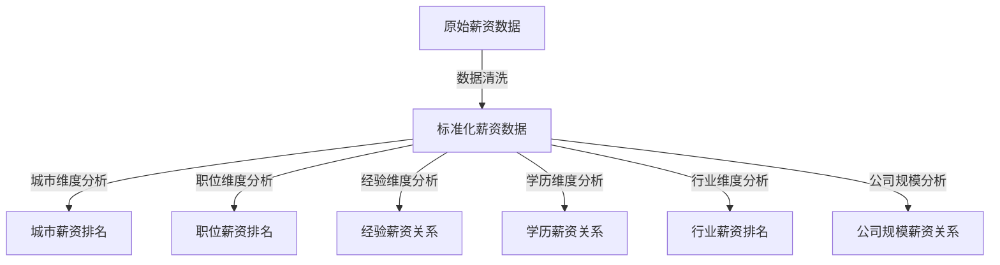

### 职位需求分析

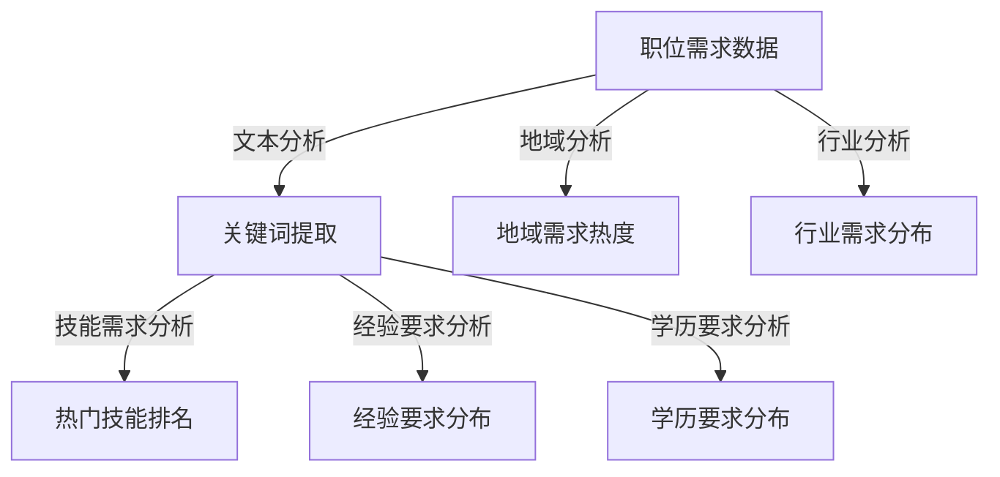

### 趋势预测分析

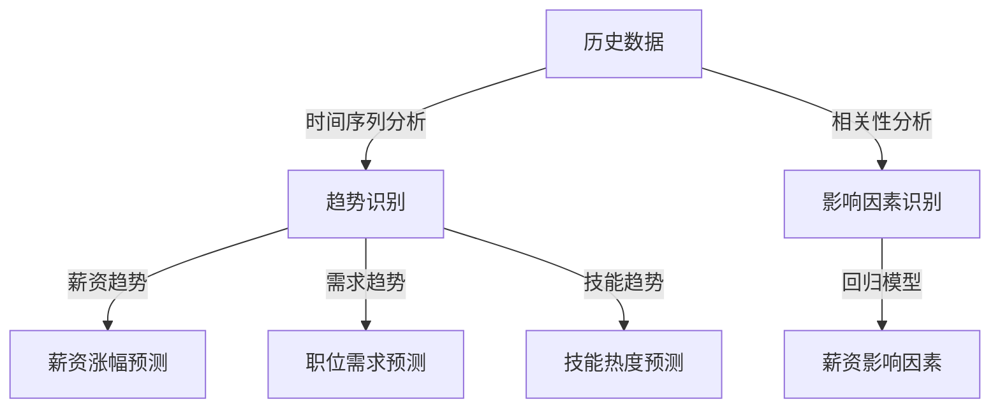

## 🎯 应用场景

1. **求职者决策支持**：

   - 了解不同城市、不同职位的薪资水平
   - 掌握不同职位的技能需求和经验要求
   - 识别高薪职位和热门职位，优化求职策略

2. **企业 HR 参考**：

   - 了解市场薪资水平，制定合理的薪资策略
   - 分析人才需求趋势，优化招聘计划
   - 评估竞争对手的招聘情况，制定差异化策略

3. **教育培训机构**：

   - 了解市场技能需求，优化课程设置
   - 分析不同行业的人才需求，提供精准的职业规划建议
   - 跟踪技能需求变化趋势，预测未来热门技能

4. **政策研究机构**：
   - 分析区域就业情况，为政策制定提供数据支持
   - 研究产业结构变化对就业市场的影响
   - 评估教育投入与就业市场的匹配程度

## 🚀 系统部署

### 开发环境

- JDK 17+
- Node.js 16+
- Python 3.8+
- MySQL 8.0+
- Redis 6.0+
- Spark 3.3.0

### 部署架构

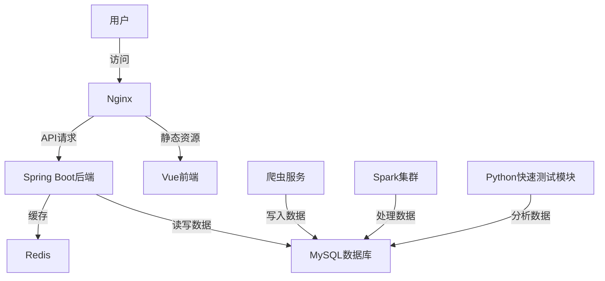

## 🔮 未来规划

1. **数据源扩展**：接入更多招聘平台数据，如拉勾、智联招聘等
2. **AI 能力增强**：引入机器学习模型，提供个性化职业规划建议
3. **实时数据分析**：支持实时数据采集和分析，提供最新市场动态
4. **国际化支持**：扩展支持国际招聘市场数据分析
5. **移动端应用**：开发移动端应用，提供随时随地的数据查询服务

## 👥 贡献指南

欢迎对 BossAnalyze 项目进行贡献，您可以通过以下方式参与：

1. 提交 Issue：报告 bug 或提出新功能建议
2. 提交 Pull Request：贡献代码或文档改进
3. 参与讨论：在 Issue 或 Discussion 中分享您的想法

## 📜 许可证

本项目采用 MIT 许可证，详情请参阅 LICENSE 文件。

## 📞 联系方式

- 项目负责人：David
- 项目仓库：https://github.com/DavidHLP/BossAnalyze
- 电子邮件：lysf15520112973@163.com
