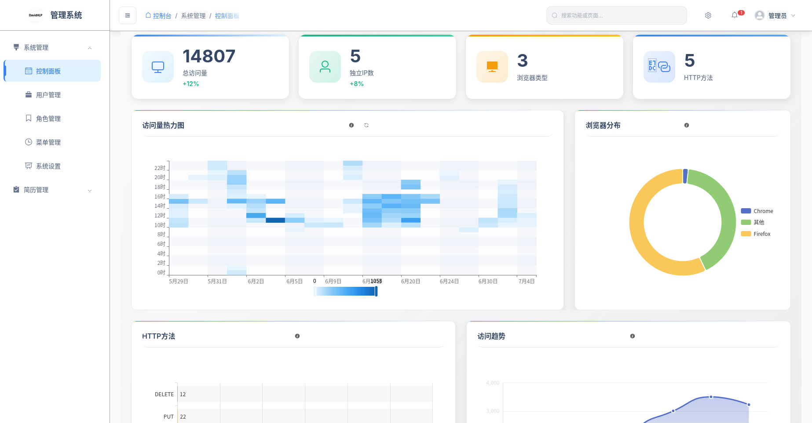
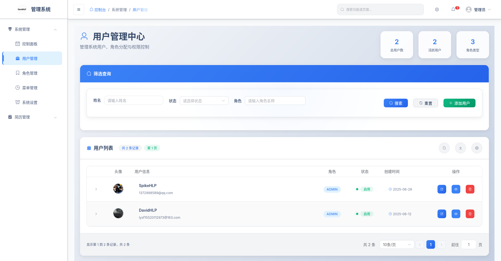
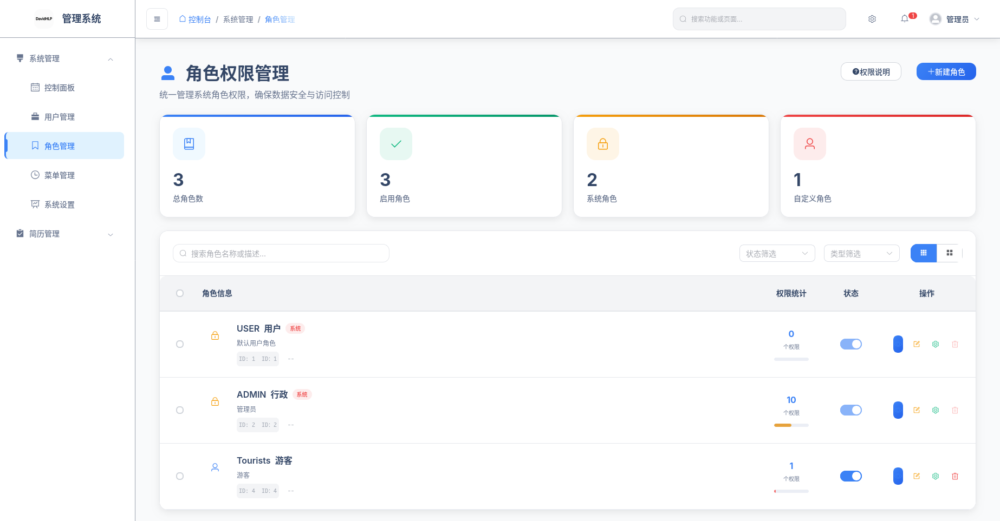
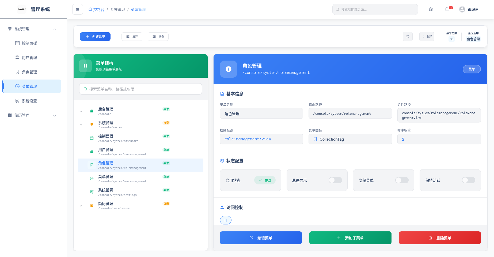
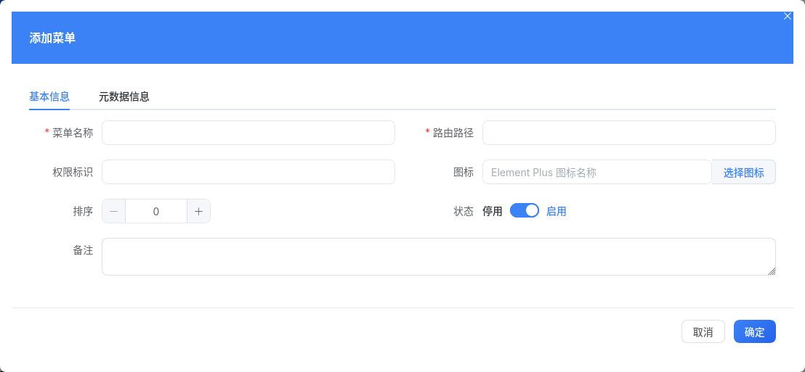

# BossAnalyze - BOSS 直聘数据分析系统

[](https://www.oracle.com/java/)
[](https://spring.io/projects/spring-boot)
[](https://spring.io/projects/spring-cloud)
[](https://vuejs.org/)
[](https://nodejs.org/)
[](https://spark.apache.org/)
[](https://www.scala-lang.org/)
[](https://maven.apache.org/)
[](LICENSE)
[](https://deepwiki.com/DavidHLP/BossAnalyze)

## 📌 目录

1. [项目介绍](#-项目介绍)
2. [技术栈](#-技术栈)
3. [项目结构](#-项目结构)
4. [项目展示](#-项目展示)
5. [项目计划](#-项目计划)

## 📋 项目介绍

BossAnalyze 是一个基于微服务架构的 BOSS 直聘招聘数据分析与可视化平台，采用 Spring Cloud 生态构建，旨在为求职者、招聘方和数据分析师提供深度的招聘市场洞察。通过分布式爬虫系统爬取、清洗和分析 BOSS 直聘的招聘数据，本系统能够实时展示不同职位、地区、行业的薪资分布、技能需求以及市场趋势。

### ✨ 核心功能

- **📊 多维度分析**：支持城市、职位、行业、公司规模等多维度交叉分析
- **📈 实时看板**：动态展示关键指标和趋势变化
- **🤖 智能推荐**：基于 AI 算法的个性化职位推荐
- **🔍 技能图谱**：可视化展示技能关联性和需求热度
- **💰 薪资预测**：基于大数据的精准薪资范围预测

### 🎯 目标用户

| 用户群体      | 核心价值                                 |
| ------------- | ---------------------------------------- |
| 👨‍💼 求职者     | 掌握市场薪资水平，优化求职策略           |
| 🏢 企业 HR    | 了解行业人才分布，制定有竞争力的招聘方案 |
| 🎓 教育机构   | 把握市场需求，优化课程设置               |
| 📊 市场分析师 | 获取深度洞察，支持决策分析               |

### 🚀 项目特色

- **☁️ 云原生架构**：基于 Spring Cloud 的微服务解决方案
- **⚡ 高性能处理**：Apache Spark 驱动的大规模数据处理
- **🔒 安全可靠**：完善的身份认证与授权机制
- **📱 响应式设计**：适配 PC

## 🛠️ 技术栈

### 后端技术

| 技术栈           | 版本         | 说明                           | 应用场景                                                         |
| ---------------- | ------------ | ------------------------------ | ---------------------------------------------------------------- |
| **Java**         | 17+          | 主要开发语言                   | 后端服务开发                                                     |
| **Spring Boot**  | 3.4.5        | 应用框架，简化 Spring 应用开发 | 快速构建独立运行、生产级别的 Spring 应用                         |
| **Spring Cloud** | 4.2.1        | 微服务框架                     | Consul 服务注册与发现、OpenFeign 服务调用、LoadBalancer 负载均衡 |
| **Apache Spark** | 4.0.0        | 大数据处理框架                 | 处理大规模 BOSS 直聘数据、用户行为分析、实时计算                 |
| **MySQL**        | 8.0+         | 关系型数据库                   | 存储用户账户、权限、系统配置等核心结构化数据                     |
| **Redis**        | 6.2+         | 高性能键值对存储               | 会话管理、缓存热点数据、分布式锁、限流控制                       |
| **Hadoop HDFS**  | 3.3.4        | 分布式文件系统                 | 集中存储和管理系统日志、用户行为日志等海量数据                   |
| **MongoDB**      | 6.0+         | 文档数据库                     | 存储非结构化数据，如 JSON 格式的简历数据、用户配置信息           |
| **MinIO**        | RELEASE.2023 | 高性能对象存储                 | 存储用户上传的简历附件、分析报告等文件                           |

### 前端技术

| 技术栈       | 说明       | 版本   |
| ------------ | ---------- | ------ |
| Vue.js       | 前端框架   | 3.3.0  |
| TypeScript   | 开发语言   | 5.0+   |
| Element Plus | UI 组件库  | 2.3.9  |
| ECharts      | 数据可视化 | 5.4.3  |
| Pinia        | 状态管理   | 2.1.0+ |
| Vite         | 构建工具   | 4.0+   |

### 开发工具

- **版本控制**：Git
- **构建工具**：Maven 3.9.6+
- **容器化**：Docker 20.10+
- **CI/CD**：GitHub Actions
- **代码质量**：SonarQube, ESLint, Prettier

## 🏗️ 项目结构

```
.
├── JDK17SERVE/               # 后端服务
│   ├── crawler/             # 爬虫服务
│   │   ├── src/main/java/com/david/hlp/crawler
│   │   │   ├── ai/          # AI 智能分析
│   │   │   ├── boss/        # BOSS 直聘数据采集
│   │   │   └── common/      # 公共模块
│   │   └── src/main/resources/
│   │       └── mapper/      # MyBatis Mapper 文件
│   │
│   ├── spark/             # Spark 大数据处理
│   │   └── src/main/java/com/david/hlp/spark
│   │       ├── config/      # Spark 配置
│   │       ├── controller/  # 控制器
│   │       ├── service/     # 服务层
│   │       └── utils/       # 工具类
│   │
│   └── spring/           # Spring Boot 主应用
│       └── src/main/java/com/david/hlp/web
│           ├── ai/          # AI 服务接口
│           ├── boss/        # BOSS 业务模块
│           ├── common/      # 公共模块
│           ├── hdfs/        # HDFS 存储
│           ├── minio/       # 文件存储
│           ├── resume/      # 简历管理
│           └── system/      # 系统管理
│
├── vue/                   # 前端项目
│   ├── public/             # 静态资源
│   ├── src/
│   │   ├── api/          # API 接口
│   │   ├── assets/         # 资源文件
│   │   ├── components/     # 公共组件
│   │   ├── router/         # 路由配置
│   │   ├── stores/         # 状态管理
│   │   ├── utils/          # 工具函数
│   │   └── views/          # 页面组件
│   │       ├── console/    # 控制台页面
│   │       └── front/      # 前台页面
│   └── package.json        # 项目配置
├── docker/                 # Docker 配置
│   ├── mysql/             # MySQL 配置
│   ├── redis/             # Redis 配置
│   └── nginx/             # Nginx 配置
├── docs/                  # 文档
│   ├── api/               # API 文档
│   └── db/                # 数据库设计文档
├── docker-compose.yml     # Docker 容器编排
├── Dockerfile             # Docker 构建文件
└── README.md             # 项目说明
```

### 后端服务 (JDK17SERVE)

| 模块       | 功能说明                             |
| ---------- | ------------------------------------ |
| `crawler/` | 数据采集服务，负责爬取 BOSS 直聘数据 |
| `spark/`   | 大数据处理模块，支持海量数据分析     |
| `spring/`  | 核心业务模块，提供 RESTful API       |

### 前端项目 (vue/)

| 目录                 | 说明         |
| -------------------- | ------------ |
| `src/views/console/` | 管理后台页面 |
| `src/views/front/`   | 前台展示页面 |
| `src/components/`    | 公共组件     |
| `src/stores/`        | 状态管理     |
| `src/api/`           | 接口请求封装 |

## 🖼️ 项目展示

### 用户认证

| 功能     | 截图                                        |
| -------- | ------------------------------------------- |
| 用户登录 |  |
| 用户注册 |  |

### 系统管理

| 功能     | 截图                                        |
| -------- | ------------------------------------------- |
| 控制台   |    |
| 用户管理 |  |
| 角色管理 |  |
| 权限分配 |  |
| 菜单管理 |  |
| 菜单编辑 |  |

### 核心功能

| 功能     | 截图                                        |
| -------- | ------------------------------------------- |
| 简历编辑 |  |
| 简历列表 |  |
| 简历分析 |  |
| 薪资分析 |  |
| 职位分析 |  |

## 📅 项目计划

### ✅ 已完成功能

- [x] **基础权限控制与用户管理**：完整的 RBAC 权限控制系统
- [x] **基础数据管理**：职位、行业、地区等基础数据维护
- [x] **简历管理**：支持简历的增删改查与智能分析
- [x] **薪资分析**：多维度的薪资数据统计与可视化
- [x] **职位分析**：职位需求趋势与技能要求分析

### 🎯 求职者功能规划

- [ ] **智能简历优化**：基于目标职位自动优化简历内容
- [ ] **AI 面试模拟**：智能模拟面试场景，提供实时反馈
- [ ] **职业路径规划**：基于用户画像的个性化职业发展建议
- [ ] **薪资谈判助手**：提供市场薪资数据支持
- [ ] **技能提升建议**：根据职位需求推荐学习路径

### 🏢 企业功能规划

- [ ] **人才画像**：多维度构建候选人画像
- [ ] **智能匹配**：AI 驱动的职位与人才智能匹配
- [ ] **招聘流程管理**：端到端招聘流程管理
- [ ] **人才库建设**：企业专属人才资源池
- [ ] **市场薪酬报告**：行业薪酬数据分析报告

### 🚀 平台优化方向

- [ ] **移动端适配**：响应式设计，支持移动端访问
- [ ] **数据大屏**：实时数据可视化大屏展示
- [ ] **国际化支持**：多语言界面适配
- [ ] **第三方登录**：支持主流账号体系接入
- [ ] **数据导出**：支持多种格式的数据导出与报告生成
