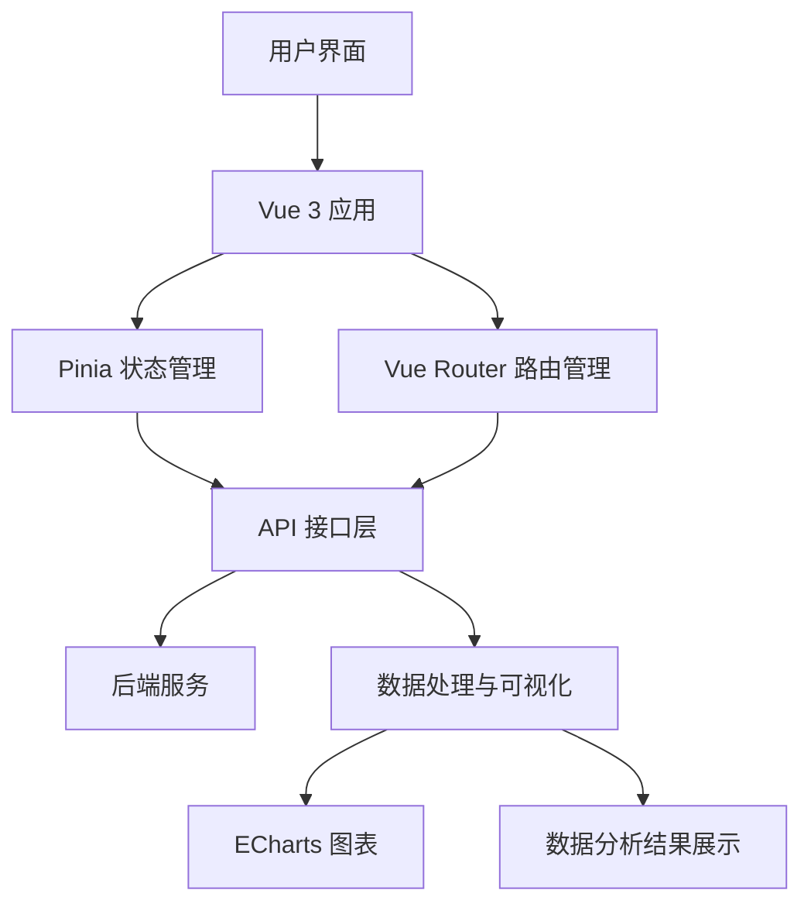
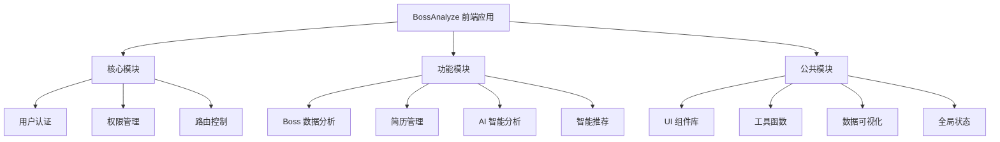
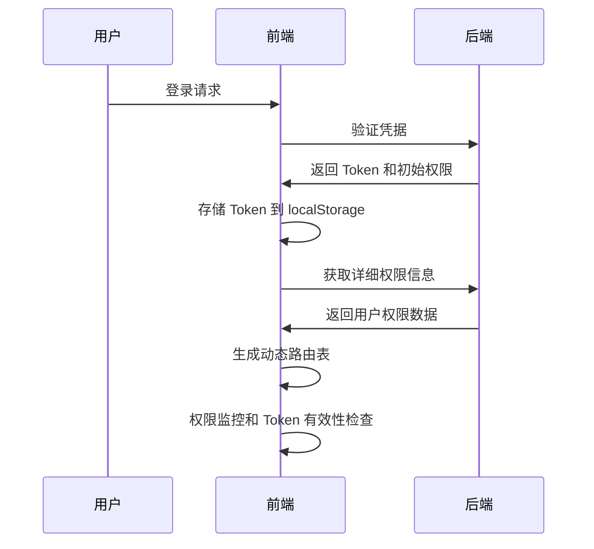
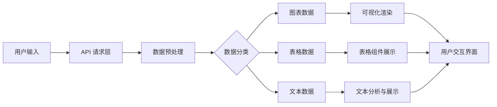

# BossAnalyze 前端技术文档

## 1. 技术架构

### 整体架构图



### 技术栈选型

#### 前端技术栈
- **核心框架**: Vue 3 (使用 Composition API)
- **构建工具**: Vite 6
- **开发语言**: TypeScript 5.7
- **状态管理**: Pinia 3.0 (带持久化存储)
- **路由管理**: Vue Router 4.5
- **UI 组件库**: 
  - Element Plus 2.9
  - Bootstrap Vue Next
- **样式处理**: SASS
- **数据可视化**: 
  - ECharts 5
  - ECharts WordCloud
  - ECharts GL
  - ECharts AMap Extension
- **工作流图表**: Vue Flow
- **动画效果**: Anime.js
- **HTTP 客户端**: Axios
- **文档编辑**: MD-Editor-V3
- **导出功能**: html2canvas, jsPDF
- **代码格式化**: ESLint, Prettier

#### 后端技术栈
- 通过 RESTful API 与后端服务交互
- 支持权限管理和用户认证

### 系统模块划分



主要模块说明：
1. **核心模块**
   - 用户认证：处理登录、注册和权限验证
   - 权限管理：基于角色的访问控制
   - 路由控制：动态路由和导航管理

2. **功能模块**
   - Boss 数据分析：职位、薪资和公司数据分析
   - 简历管理：简历解析和管理
   - AI 智能分析：智能数据处理
   - 用户管理：用户信息和配置

3. **公共模块**
   - UI 组件库：可复用的界面组件
   - 工具函数：通用工具和辅助方法
   - 数据可视化：图表和数据展示组件
   - 全局状态：应用状态管理

## 2. 核心技术实现

### 关键功能技术方案

#### 1. 动态权限管理

系统采用基于 RBAC (基于角色的访问控制) 的权限管理机制：
- 前端路由与后端权限数据集成
- 动态路由加载，根据用户权限自动配置可访问页面
- 权限粒度控制到按钮级别
- Token 有效期管理和自动刷新机制



#### 2. 数据可视化实现

系统利用多种可视化技术呈现数据：
- 二维分析图表：使用 ECharts 实现散点图、热力图等
- 三维数据分析：通过 ECharts-GL 实现 3D 可视化
- 地理数据展示：集成 ECharts-AMap 实现地理位置分析
- 词云分析：使用 ECharts-WordCloud 进行文本数据可视化

#### 3. 流程图与工作流

基于 Vue Flow 实现交互式流程图和工作流设计：
- 支持拖拽操作
- 节点自定义
- 连接线样式定制
- 小地图导航
- 背景网格和控制面板

### 数据处理流程



数据处理主要流程：
1. 通过 API 接口获取原始数据
2. 使用 TypeScript 类型系统确保数据类型安全
3. 针对不同数据类型进行格式转换和预处理
4. 根据业务需求进行数据聚合和统计
5. 将处理后的数据传递给相应的展示组件

### 性能优化策略

1. **前端渲染优化**
   - 组件懒加载：非核心路由采用动态导入
   - 虚拟滚动：处理大量数据列表
   - 图片懒加载：提高页面加载速度

2. **状态管理优化**
   - 使用 Pinia 进行高效的状态管理
   - 持久化存储关键状态，减少重复请求
   - 精细化的状态分割，避免不必要的组件重渲染

3. **网络请求优化**
   - 请求合并与缓存策略
   - 数据预加载
   - 接口错误重试机制

4. **构建优化**
   - Vite 快速热更新
   - 代码分割和按需加载
   - 静态资源压缩和优化

## 3. 项目结构说明

```
src/
├── api/                 # API 接口层
│   ├── boss/            # Boss 数据相关 API
│   ├── resume/          # 简历相关 API
│   ├── ai/              # AI 服务相关 API
│   ├── auth/            # 认证相关 API
│   └── ...
├── assets/              # 静态资源
├── components/          # 公共组件
├── composables/         # 组合式函数
├── router/              # 路由配置
├── stores/              # Pinia 状态管理
│   ├── user/            # 用户状态
│   ├── router/          # 路由状态
│   └── ...
├── types/               # TypeScript 类型定义
├── utils/               # 工具函数
├── views/               # 页面视图组件
│   ├── front/           # 前台页面
│   └── admin/           # 管理页面
└── main.ts              # 应用入口文件
```

## 4. 开发与部署

### 开发环境
```bash
# 安装依赖
yarn install

# 启动开发服务器
yarn dev

# 代码检查与修复
yarn lint

# 代码格式化
yarn format
```

### 生产环境构建
```bash
# 构建生产版本
yarn build

# 预览生产构建
yarn preview
```

### 部署建议
- 使用 Docker 容器化部署
- 配合 Nginx 作为静态资源服务器
- 考虑使用 CDN 加速静态资源访问
- 实施前端监控和错误跟踪
