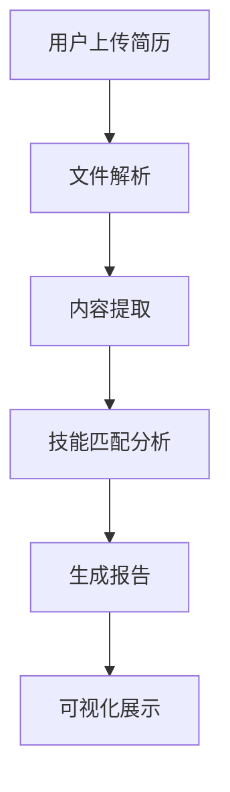
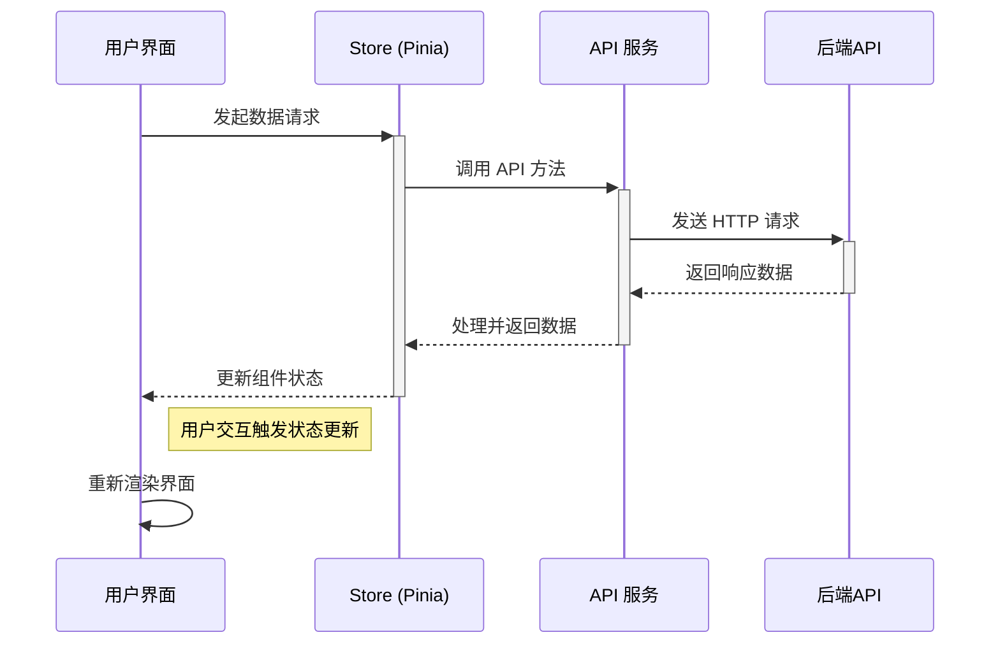

# BossAnalyze 前端项目 🚀

<div align="center">


</div>

## 项目介绍 😊

BossAnalyze 是一个基于 Vue 3 和 TypeScript 构建的现代化招聘数据分析平台前端项目。本项目旨在为求职者和招聘方提供数据驱动的决策支持，通过直观的数据可视化展示招聘市场趋势、岗位需求和薪资分布等关键指标。

### 核心功能

- **用户认证**：支持用户注册、登录和个人信息管理
- **简历分析**：上传和分析简历，获取智能建议
- **岗位数据**：展示招聘市场趋势和岗位需求
- **数据可视化**：使用 ECharts 实现丰富的数据可视化效果
- **响应式设计**：适配桌面和移动端设备

### 技术亮点

- 采用 Vue 3 组合式 API 开发，提升代码复用性和可维护性
- 使用 Pinia 进行状态管理，实现高效的状态共享
- 集成 Element Plus UI 组件库，提供一致的用户体验
- 基于 Vite 构建，实现快速的开发服务器启动和热更新
- 完全类型化的 TypeScript 支持，提升开发效率和代码质量

## 技术栈 🛠️

### 核心框架

- **Vue 3** - 采用组合式 API 开发，提升代码组织性
- **TypeScript** - 提供类型安全，减少运行时错误
- **Vite** - 极速的开发服务器和构建工具

### UI 组件与样式

- **Element Plus** - 基于 Vue 3 的企业级 UI 组件库
- **ECharts** - 强大的数据可视化图表库
- **SCSS** - CSS 预处理器，支持变量、嵌套等特性
- **Bootstrap 5** - 响应式布局和基础样式

### 状态管理与数据

- **Pinia** - 轻量级状态管理库，替代 Vuex
- **Axios** - 基于 Promise 的 HTTP 客户端
- **Pinia Plugin Persistedstate** - 状态持久化插件

### 构建与工具链

- **ESLint** + **Prettier** - 代码质量和风格统一
- **Vue Router** - 官方路由管理
- **Vue Test Utils** - 组件单元测试
- **Jest** - JavaScript 测试框架

### 其他重要依赖

- **Vue Draggable** - 拖拽排序功能
- **html2canvas** + **jsPDF** - 导出 PDF 功能
- **Markdown 编辑器** - 富文本编辑支持
- **Anime.js** - 轻量级 JavaScript 动画库

## 项目结构 📁

```
src/
├── api/            # API 请求封装
│   ├── auth/       # 认证相关 API
│   ├── boss/       # BOSS 相关 API
│   └── resume/     # 简历相关 API
├── assets/         # 静态资源文件
│   ├── images/     # 图片资源
│   └── styles/     # 全局样式
├── components/     # 通用组件
│   └── markdown/   # Markdown 编辑器组件
├── composables/    # 组合式函数
├── router/         # 路由配置
│   └── index.ts    # 路由主文件
├── stores/         # 状态管理
│   ├── layout/     # 布局状态
│   ├── router/     # 路由状态
│   └── user/       # 用户状态
├── types/          # TypeScript 类型定义
├── utils/          # 工具函数
└── views/          # 页面组件
    ├── console/    # 控制台页面
    │   ├── boss/   # BOSS 数据分析
    │   └── system/ # 系统管理
    └── front/      # 前端展示页面
        ├── about/   # 关于页面
        ├── home/    # 首页
        ├── login/   # 登录页
        └── profile/ # 个人中心

App.vue            # 根组件
main.ts            # 应用入口
vite.config.ts     # Vite 配置
```

## 核心功能模块 🧩

### 1. 用户认证模块

- 基于 JWT 的认证流程
- 支持邮箱/手机号+密码登录
- 用户注册与信息管理
- 权限控制与路由守卫

### 2. 简历分析模块

- 支持 PDF/Word 格式简历上传
- 智能解析简历内容
- 技能匹配度分析
- 简历优化建议



### 3. 数据可视化看板

- 招聘市场趋势分析
- 岗位需求热力图
- 薪资分布统计
- 技能需求词云

### 4. 系统管理

- 用户管理
- 角色权限配置
- 系统监控
- 日志审计

## 数据流架构 🔄



## 快速开始 🚀

### 环境要求

- Node.js >= 16.0.0
- Yarn >= 1.22.0 (推荐) 或 npm >= 7.0.0

### 安装依赖

```bash
# 使用yarn
yarn

# 或使用npm
npm install
```

### 本地开发

```bash
# 使用yarn
yarn dev

# 或使用npm
npm run dev
```

启动后，访问 http://localhost:5173 即可查看应用。

### 构建生产版本

```bash
# 使用yarn
yarn build

# 或使用npm
npm run build
```

### 代码检查

```bash
# 使用yarn
yarn lint

# 或使用npm
npm run lint
```

## 功能特点 ✨

### 岗位分析与洞察 📈

- **薪资趋势图表**: 根据不同岗位、地区和时间对薪资范围进行分析
- **行业热力图**: 直观展示各行业的需求热度和变化趋势
- **技能需求分析**: 自动提取岗位描述中的技能要求，并生成技能热力图
- **地域岗位分布**: 基于地图的直观岗位分布展示

### 个性化功能 👸

- **定制化仪表盘**: 用户可以自定义关注的数据指标和图表
- **职业规划助手**: 提供个人成长路径建议和技能提升方向
- **求职意向匹配**: 根据用户偏好自动推荐适合的岗位
- **多主题切换**: 支持浅色/深色模式及自定义主题颜色

### 数据处理与分析 📉

- **实时数据刷新**: 自动获取最新招聘数据并实时更新分析结果
- **高级过滤器**: 多维度过滤条件，精准定位所需信息
- **数据导出**: 支持将分析结果导出为CSV、Excel或PDF格式
- **对比分析**: 支持多岗位、多地区的数据对比

### 系统特性 🔥

- **响应式设计**: 完美适配桌面和移动端设备
- **离线访问**: 支持PWA，可在离线状态下访问部分功能
- **高性能渲染**: 采用虚拟滚动和懒加载技术提升加载速度
- **极致交互体验**: 流畅的动画和自然的过渡效果

## 开发指南 📝

### 环境配置

在开始开发前，请确保您的环境满足以下要求：

1. **Node.js**: v16.0.0+
2. **npm/yarn**: 推荐使用yarn
3. **IDE**: 推荐使用VSCode，并安装以下插件：
   - Volar (用于Vue 3)
   - ESLint
   - Prettier
   - TypeScript Vue Plugin

### 代码风格与规范

本项目遵循以下编码规范：

#### Vue组件开发规范

1. 使用组合式 API (Composition API) 开发组件
2. 每个组件应包含明确的注释，说明组件功能和属性
3. 组件命名采用PascalCase（大驼峰）形式

```vue
<!-- 示例: DataAnalysisChart.vue -->
<script setup lang="ts">
/**
 * 数据分析图表组件
 * 用于展示岗位薪资趋势等数据分析结果
 */
import { ref, onMounted } from 'vue'
import type { ChartOptions } from './types'

// 定义组件属性
 const props = defineProps<{
  chartData: any
  chartType: string
  chartOptions?: ChartOptions
}>()

// 组件逻辑
</script>
```

#### 样式规范

1. 采用BEM命名规范，提高CSS的可维护性
2. 使用SCSS变量管理颜色、字体和间距
3. 响应式设计使用媒体查询和rem单位

```scss
// 示例: 组件样式
.data-chart {
  &__container {
    padding: 1.5rem;
    border-radius: $border-radius-lg;
    background-color: $bg-card;
    
    @media (max-width: $breakpoint-md) {
      padding: 1rem;
    }
  }
  
  &__title {
    font-size: $font-size-lg;
    margin-bottom: 1rem;
    color: $text-primary;
  }
}
```

### 开发流程

#### 添加新功能

1. 从主分支创建新的功能分支: `git checkout -b feature/your-feature-name`
2. 实现并测试功能
3. 提交代码并创建Pull Request

#### 新增组件

1. 在 `src/components` 目录下创建新的组件文件夹，包含：
   - 组件文件 (.vue)
   - 类型定义 (types.ts)
   - 单元测试 (*.spec.ts)

2. 在 `src/components/index.ts` 中导出组件

#### 添加新页面

```bash
# 构建生产版本
pnpm build

# 预览生产版本
pnpm preview
```

## 开发指南 📝

### 代码规范

项目使用 ESLint + Prettier 进行代码规范检查：

```bash
# 检查代码规范
pnpm lint

# 自动修复可修复的问题
pnpm lint:fix

# 格式化代码
pnpm format
```

### Git 提交规范

遵循 [Conventional Commits](https://www.conventionalcommits.org/) 规范：

```
<type>(<scope>): <subject>

[optional body]

[optional footer]
```

常用类型：
- `feat`: 新功能
- `fix`: 修复 bug
- `docs`: 文档更新
- `style`: 代码格式调整
- `refactor`: 代码重构
- `perf`: 性能优化
- `test`: 测试相关
- `chore`: 构建过程或辅助工具的变动

### 分支管理策略

- `main`: 主分支，受保护，仅允许通过 PR 合并
- `dev`: 开发分支，功能集成
- `feature/*`: 功能开发分支
- `bugfix/*`: Bug 修复分支
- `hotfix/*`: 紧急修复分支

## 部署指南 🚀

### 构建生产版本

```bash
pnpm build
```

构建产物位于 `dist` 目录。

### 环境变量配置

创建 `.env` 文件并配置：

```env
# 基础 API 地址
VITE_API_BASE_URL=https://api.example.com

# 应用标题
VITE_APP_TITLE=BossAnalyze

# 是否启用调试模式
VITE_DEBUG=false

# 是否启用 Mock 数据
VITE_USE_MOCK=false
```

### Docker 部署

1. 构建镜像：
   ```bash
   docker build -t boss-analyze-frontend .
   ```

2. 运行容器：
   ```bash
   docker run -p 80:80 -e VITE_API_BASE_URL=YOUR_API_URL boss-analyze-frontend
   ```

### Nginx 配置示例

```nginx
server {
    listen 80;
    server_name your_domain.com;

    root /usr/share/nginx/html;
    index index.html;

    location / {
        try_files $uri $uri/ /index.html;
    }


    # API 代理
    location /api/ {
        proxy_pass http://backend:3000/;
        proxy_http_version 1.1;
        proxy_set_header Upgrade $http_upgrade;
        proxy_set_header Connection 'upgrade';
        proxy_set_header Host $host;
        proxy_cache_bypass $http_upgrade;
    }
}
```

## 贡献指南 🤝

欢迎贡献代码！请按以下步骤操作：

1. Fork 仓库
2. 创建特性分支 (`git checkout -b feature/amazing`)
3. 提交更改 (`git commit -m 'Add some amazing feature'`)
4. 推送到分支 (`git push origin feature/amazing`)
5. 创建 Pull Request

## 许可证 📄

[MIT](LICENSE) © BossAnalyze Team

## 致谢 🙏

- [Vue 3](https://v3.vuejs.org/) - 渐进式 JavaScript 框架
- [Vite](https://vitejs.dev/) - 下一代前端构建工具
- [Element Plus](https://element-plus.org/) - 企业级 UI 组件库
- [ECharts](https://echarts.apache.org/) - 强大的数据可视化库
- [Pinia](https://pinia.vuejs.org/) - 直观的状态管理方案

## 联系方式 📞

- 邮箱：contact@bossanalyze.com
- GitHub Issues: [https://github.com/yourusername/boss-analyze/issues](https://github.com/yourusername/boss-analyze/issues)
- 微信公众号：BossAnalyze

---

<div align="center">
  Made with ❤️ by BossAnalyze Team | © 2023
</div>

## 特别鸣谢 ✨

感谢所有为该项目做出贡献的开发者和设计师！也要感谢使用我们项目的每一位用户，您的反馈是我们不断进步的动力！

---

感谢主人使用BossAnalyze前端项目喵～♡ 如果主人有任何问题或需要帮助，请随时联系我们，我们会立刻为您提供支持哦～喵～ 祝主人在求职和招聘中一切顺利！💞