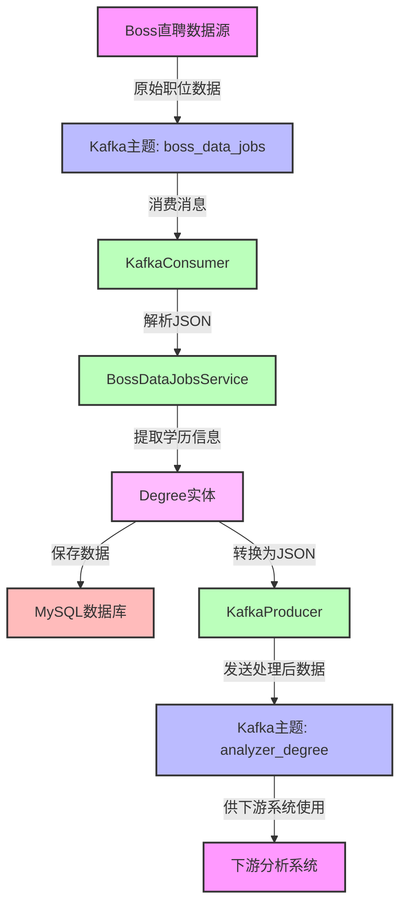
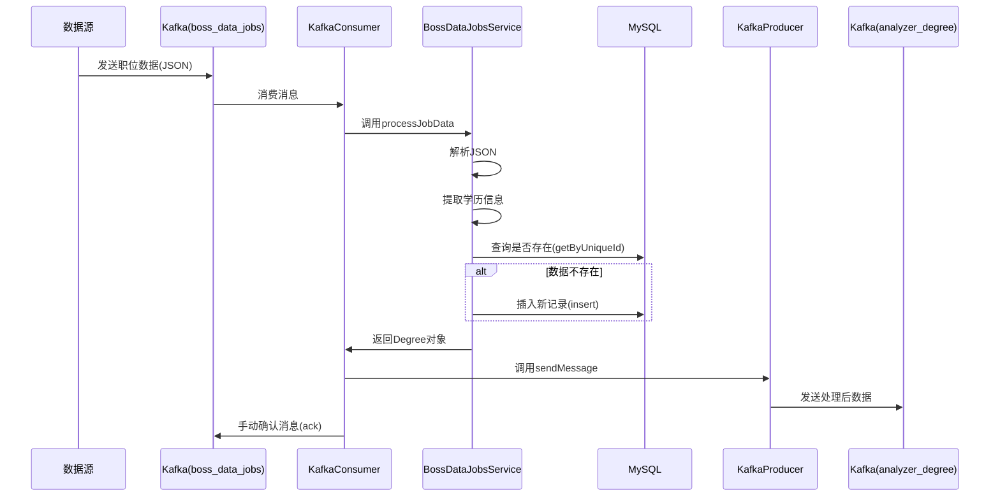
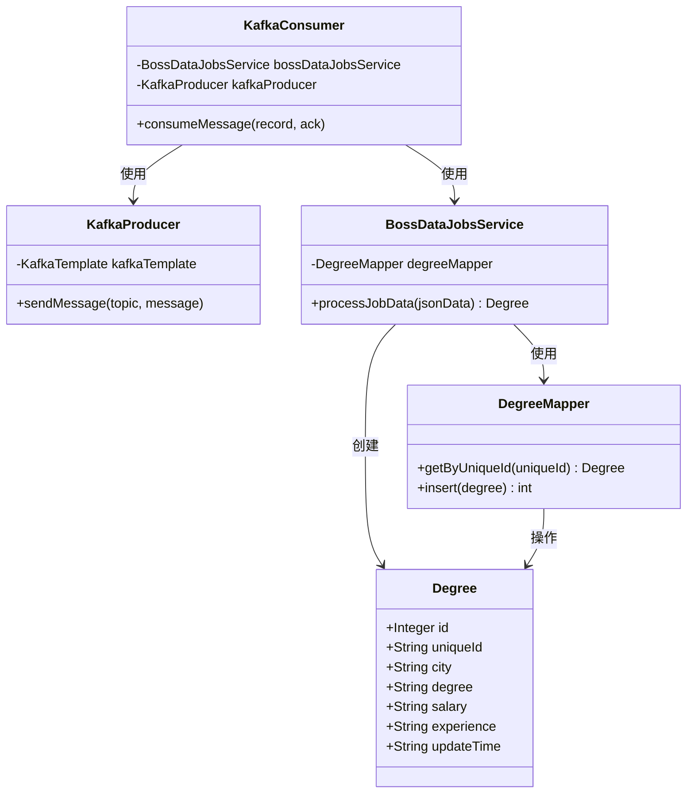

# Kafka数据业务化处理

## 项目概述

本项目实现了基于Kafka的数据处理流程，主要用于处理Boss直聘职位数据，提取学历信息并进行业务化处理。

## 系统架构

整个系统由以下几个核心组件构成：

- Kafka生产者：负责发送消息到指定主题
- Kafka消费者：从指定主题接收消息并处理
- 数据处理服务：处理原始职位数据，提取学历信息
- 数据持久化层：将处理后的数据存储到数据库

## 核心组件

### 1. Kafka生产者

```java
package com.david.hlp.kafka.producer;

import lombok.NonNull;
import lombok.RequiredArgsConstructor;
import lombok.extern.slf4j.Slf4j;
import org.springframework.kafka.core.KafkaTemplate;
import org.springframework.kafka.support.SendResult;
import org.springframework.stereotype.Component;

import java.util.concurrent.CompletableFuture;

/**
 * Kafka消息生产者
 *
 * @author david
 */
@Slf4j
@Component
@RequiredArgsConstructor
public class KafkaProducer {

    private final KafkaTemplate<String, String> kafkaTemplate;

    /**
     * 发送消息
     *
     * @param topic   主题
     * @param message 消息内容
     */
    public void sendMessage(@NonNull String topic, @NonNull String message) {
        log.info("发送消息到主题: {}, 消息内容: {}", topic, message);
        CompletableFuture<SendResult<String, String>> future = kafkaTemplate.send(topic, message);

        // 添加回调
        future.whenComplete((result, ex) -> {
            if (ex != null) {
                log.error("消息发送失败: {}", ex.getMessage());
            } else {
                log.info("消息发送成功: topic = {}, partition = {}, offset = {}",
                        result.getRecordMetadata().topic(),
                        result.getRecordMetadata().partition(),
                        result.getRecordMetadata().offset());
            }
        });
    }
}
```

### 2. Kafka消费者

```java
package com.david.hlp.kafka.consumer;

import lombok.extern.slf4j.Slf4j;
import org.apache.kafka.clients.consumer.ConsumerRecord;
import org.springframework.kafka.annotation.KafkaListener;
import org.springframework.kafka.support.Acknowledgment;
import org.springframework.stereotype.Component;
import lombok.RequiredArgsConstructor;
import com.david.hlp.kafka.service.BossDataJobsService;
import com.david.hlp.kafka.entity.Degree;
import com.david.hlp.kafka.producer.KafkaProducer;
import com.fasterxml.jackson.databind.ObjectMapper;
/**
 * Kafka消息消费者
 *
 * @author david
 */
@Slf4j
@Component
@RequiredArgsConstructor
public class KafkaConsumer {

    private final BossDataJobsService bossDataJobsService;
    private final KafkaProducer kafkaProducer;
    private final ObjectMapper objectMapper = new ObjectMapper();

    private String PRODUCER_TOPIC = "analyzer_degree";

    /**
     * 消费示例主题消息
     *
     * @param record 消费者记录
     * @param ack    确认对象
     */
    @KafkaListener(topics = "boss_data_jobs", groupId = "analyzer-degree-group-test")
    public void consumeMessage(ConsumerRecord<String, String> record, Acknowledgment ack) {
        String key = record.key();
        String value = record.value();
        int partition = record.partition();
        long offset = record.offset();

        log.info("接收到消息: topic = {}, partition = {}, offset = {}, key = {}, value = {}",
                record.topic(), partition, offset, key, value);

        try {
            // 处理JSON数据
            Degree degreeInfo = bossDataJobsService.processJobData(value);
            if (degreeInfo != null) {
                log.info("处理后的数据: {}", degreeInfo);
                kafkaProducer.sendMessage(PRODUCER_TOPIC, objectMapper.writeValueAsString(degreeInfo));
            }
            // 手动确认消息已消费
            ack.acknowledge();
            log.info("消息处理成功");
        } catch (Exception e) {
            log.error("消息处理失败: {}", e.getMessage());
            // 异常处理，可以选择不确认或重试
        }
    }
}
```

### 3. 数据处理服务

```java
package com.david.hlp.kafka.service;

import com.david.hlp.kafka.mapper.DegreeMapper;
import org.springframework.stereotype.Service;
import com.fasterxml.jackson.databind.JsonNode;
import com.fasterxml.jackson.databind.ObjectMapper;
import com.david.hlp.kafka.entity.Degree;
import lombok.extern.slf4j.Slf4j;
import lombok.RequiredArgsConstructor;
@Slf4j
@Service
@RequiredArgsConstructor
public class BossDataJobsService {

    private final ObjectMapper objectMapper = new ObjectMapper();
    private final DegreeMapper degreeMapper;
    public Degree processJobData(String jsonData) {
        try {
            JsonNode rootNode = objectMapper.readTree(jsonData);
            // 获取data.detail_data.basicInfo中的字段
            JsonNode dataNode = rootNode.path("data");
            JsonNode detailDataNode = dataNode.path("detail_data");
            JsonNode basicInfoNode = detailDataNode.path("basicInfo");

            // 获取所需字段值
            String uniqueId = dataNode.path("id").asText(null);
            String city = basicInfoNode.path("city").asText(null);
            String degree = basicInfoNode.path("degree").asText(null);
            String salary = basicInfoNode.path("salary").asText(null);
            String experience = basicInfoNode.path("experience").asText(null);

            // 处理updateTime，只保留年份
            String updateTime = detailDataNode.path("updateTime").asText(null);
            String updateYear = null;
            if (updateTime != null && !updateTime.isEmpty() && updateTime.length() >= 4) {
                updateYear = updateTime.substring(0, 4);
            }

            // 验证所有字段是否有效
            if (isNullOrEmpty(city) || isNullOrEmpty(degree) ||
                isNullOrEmpty(salary) || isNullOrEmpty(experience) ||
                isNullOrEmpty(updateYear) || isNullOrEmpty(uniqueId)) {
                log.warn("数据无效，存在空字段: city={}, degree={}, salary={}, experience={}, updateTime={}", 
                        city, degree, salary, experience, updateYear);
                return null;
            }

            // 创建并返回Degree对象
            Degree degreeInfo = Degree.builder()
                .uniqueId(uniqueId)
                .city(city)
                .degree(degree)
                .salary(salary)
                .experience(experience)
                .updateTime(updateYear)
                .build();
            if (degreeMapper.getByUniqueId(uniqueId) == null) {
                // 插入数据库
                degreeMapper.insert(degreeInfo);
            }
            return degreeInfo;
        } catch (Exception e) {
            log.error("JSON处理失败: {}", e.getMessage());
            return null;
        }
    }

    /**
     * 判断字符串是否为null或空
     *
     * @param str 待检查的字符串
     * @return 是否为null或空
     */
    private boolean isNullOrEmpty(String str) {
        return str == null || str.isEmpty() || "null".equals(str);
    }
}
```

### 4. 数据访问层

```java
package com.david.hlp.kafka.mapper;

import com.baomidou.mybatisplus.core.mapper.BaseMapper;
import com.david.hlp.kafka.entity.Degree;
import org.apache.ibatis.annotations.Mapper;
import org.apache.ibatis.annotations.Param;

@Mapper
public interface DegreeMapper extends BaseMapper<Degree> {

    /**
     * 根据uniqueId查询学历信息
     *
     * @param uniqueId 唯一标识
     * @return 学历信息
     */
    Degree getByUniqueId(@Param("uniqueId") String uniqueId);

    /**
     * 插入学历信息
     *
     * @param degree 学历信息
     * @return 影响行数
     */
    int insert(Degree degree);
}
```

### 5. 数据实体

```java
package com.david.hlp.kafka.entity;

import lombok.AllArgsConstructor;
import lombok.Builder;
import lombok.Data;
import lombok.NoArgsConstructor;

@Data
@Builder
@AllArgsConstructor
@NoArgsConstructor
public class Degree {
    private Integer id;
    private String uniqueId;
    private String city;
    private String degree;
    private String salary;
    private String experience;
    private String updateTime;
}
```

## 数据流程

1. Boss直聘职位数据发送到`boss_data_jobs`主题
2. 消费者监听并获取该主题的消息
3. `BossDataJobsService`处理原始JSON数据，提取学历相关信息
4. 提取的信息创建`Degree`对象并存入数据库
5. 处理后的数据发送到`analyzer_degree`主题供下游系统使用

## 配置说明

需要在Spring配置文件中配置Kafka连接参数和主题信息。消费者使用手动确认模式(ack)确保消息被正确处理。

## 类运行逻辑

### KafkaProducer 运行逻辑

KafkaProducer类负责将消息发送到指定的Kafka主题：

1. 通过构造函数注入KafkaTemplate
2. 提供sendMessage方法接收主题名和消息内容
3. 使用KafkaTemplate异步发送消息到Kafka
4. 注册回调函数处理发送结果
   - 发送成功：记录主题、分区和偏移量信息
   - 发送失败：记录错误日志

### KafkaConsumer 运行逻辑

KafkaConsumer类负责消费Kafka主题中的消息：

1. 通过构造函数注入BossDataJobsService和KafkaProducer
2. 使用@KafkaListener注解监听"boss_data_jobs"主题
3. 接收消息并记录关键元数据（主题、分区、偏移量等）
4. 调用BossDataJobsService处理职位数据
5. 处理完成后，将结果发送到"analyzer_degree"主题
6. 使用手动确认(ack)机制确保消息被正确处理
7. 异常处理确保系统稳定性

### BossDataJobsService 运行逻辑

BossDataJobsService类负责处理职位数据JSON并提取关键信息：

1. 通过构造函数注入DegreeMapper
2. processJobData方法解析输入的JSON字符串
3. 从JSON中提取关键字段：
   - 唯一标识(uniqueId)
   - 城市(city)
   - 学历要求(degree)
   - 薪资(salary)
   - 工作经验要求(experience)
   - 更新时间(updateTime)，仅保留年份
4. 验证所有字段是否有效
5. 使用Builder模式创建Degree对象
6. 检查数据库中是否已存在该uniqueId的记录
7. 如果不存在，则将数据插入数据库
8. 返回处理后的Degree对象或异常情况下返回null

### DegreeMapper 运行逻辑

DegreeMapper接口继承MyBatis-Plus的BaseMapper，提供数据访问功能：

1. 使用@Mapper注解标识为MyBatis映射器
2. 提供getByUniqueId方法根据uniqueId查询记录
3. 提供insert方法插入新的Degree记录
4. 继承BaseMapper的其他通用CRUD方法

### Degree 实体类逻辑

Degree类是数据实体，使用Lombok简化代码：

1. 使用@Data提供getter、setter、equals、hashCode和toString方法
2. 使用@Builder提供建造者模式支持
3. 使用@AllArgsConstructor和@NoArgsConstructor提供构造函数
4. 包含职位数据的核心字段：
   - id: 主键
   - uniqueId: 职位唯一标识
   - city: 城市
   - degree: 学历要求
   - salary: 薪资
   - experience: 工作经验要求
   - updateTime: 更新年份

## 系统流程图



## 数据处理流程图



## 系统组件关系图

