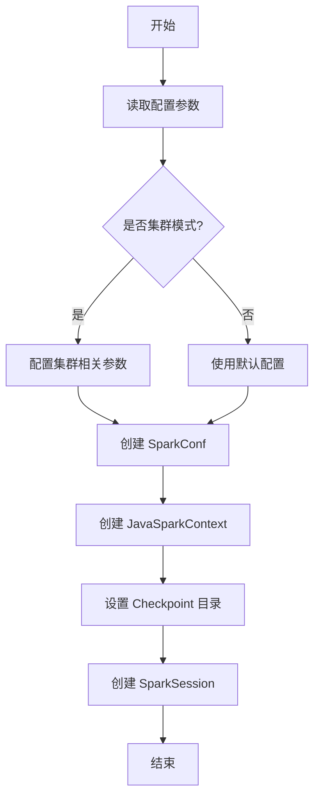
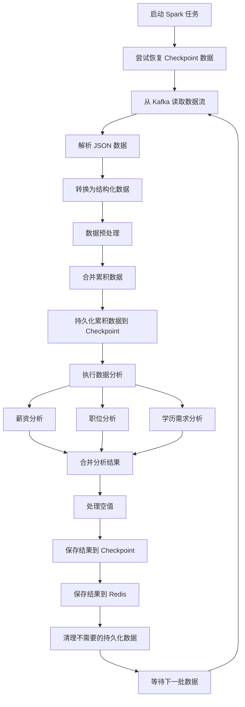
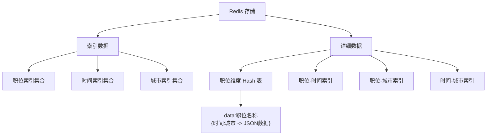

# Spark 数据挖掘与 Redis 持久化

## 最终结果展示


## 目录

- [简介](#简介)
- [Spark 配置](#spark-配置)
- [Spark 数据挖掘与 Redis 存储](#spark-数据挖掘与-redis-存储)
- [代码分析](#代码分析)
  - [SparkConfig 类分析](#sparkconfig-类分析)
  - [BossSpark 类分析](#bossspark-类分析)
- [流程图](#流程图)
  - [Spark 配置初始化流程](#spark-配置初始化流程)
  - [数据处理与 Redis 存储流程](#数据处理与-redis-存储流程)
  - [Redis 数据存储结构](#redis-数据存储结构)
- [代码思路](#代码思路)
  - [整体架构设计](#整体架构设计)
  - [关键技术点](#关键技术点)

## 简介

本文档描述了基于 Apache Spark 的数据挖掘系统，该系统从 Kafka 读取 Boss 招聘职位数据，进行多维度分析处理，并将结果持久化到 Redis 中。系统支持单机和集群两种模式，针对不同场景进行了优化配置。

## Spark 配置

SparkConfig 类是系统的配置核心，提供了灵活的配置项以适应不同的运行环境。

```java
package com.david.hlp.spark.config;

import org.apache.spark.SparkConf;
import org.apache.spark.api.java.JavaSparkContext;
import org.apache.spark.sql.SparkSession;
import org.springframework.beans.factory.annotation.Value;
import org.springframework.boot.autoconfigure.condition.ConditionalOnMissingBean;
import org.springframework.context.annotation.Bean;
import org.springframework.context.annotation.Configuration;
import lombok.Getter;
import org.slf4j.Logger;
import org.slf4j.LoggerFactory;

/**
 * Spark配置类
 */
@Configuration
@Getter
public class SparkConfig {
    private static final Logger log = LoggerFactory.getLogger(SparkConfig.class);

    @Value("${spark.app.name}")
    private String appName;

    @Value("${spark.master.uri}")
    private String masterUri;

    @Value("${spark.redis.key-prefix:spark:job:}")
    private String redisKeyPrefix;

    @Value("${spark.checkpoint.dir:/bigdata/checkpoint}")
    private String checkpointDir;

    @Value("${spark.persistence.enabled:true}")
    private boolean persistenceEnabled;

    @Value("${spark.persistence.storage-level:MEMORY_AND_DISK}")
    private String persistenceStorageLevel;

    @Value("${spark.cluster.mode:false}")
    private boolean clusterMode;

    @Value("${spark.executor.instances:2}")
    private int executorInstances;

    @Value("${spark.executor.cores:2}")
    private int executorCores;

    @Value("${spark.executor.memory:2g}")
    private String executorMemory;

    @Value("${spark.driver.memory:2g}")
    private String driverMemory;

    @Value("${spark.sql.shuffle.partitions:200}")
    private int shufflePartitions;

    @Value("${spark.default.parallelism:20}")
    private int defaultParallelism;

    @Value("${spark.distributed.fs.enabled:false}")
    private boolean distributedFsEnabled;

    @Value("${spark.distributed.fs.prefix:hdfs://namenode:8020}")
    private String distributedFsPrefix;

    /**
     * 创建Spark配置
     */
    @Bean
    public SparkConf sparkConf() {
        SparkConf conf = new SparkConf()
                .setAppName(appName)
                .setMaster(masterUri)
                .set("spark.driver.memory", driverMemory)
                .set("spark.executor.memory", executorMemory)
                .set("spark.sql.warehouse.dir", "/bigdata/jupyter/Json/warehouse");

        // 如果是集群模式，添加集群相关配置
        if (clusterMode) {
            configureClusterMode(conf);
        }

        return conf;
    }

    /**
     * 配置集群模式的Spark参数
     */
    private void configureClusterMode(SparkConf conf) {
        log.info("配置Spark集群模式，executor实例数: {}, 每个executor核心数: {}", 
                executorInstances, executorCores);

        // 设置Spark SQL的shuffle分区数，影响并行度
        conf.set("spark.sql.shuffle.partitions", String.valueOf(shufflePartitions));

        // 设置默认并行度，影响RDD分区数
        conf.set("spark.default.parallelism", String.valueOf(defaultParallelism));

        // 如果使用的是yarn集群，可以动态调整分配
        conf.set("spark.dynamicAllocation.enabled", "true");
        conf.set("spark.dynamicAllocation.initialExecutors", String.valueOf(executorInstances));

        // 设置序列化方式为Kryo，提高性能
        conf.set("spark.serializer", "org.apache.spark.serializer.KryoSerializer");

        // 设置广播变量的压缩
        conf.set("spark.broadcast.compress", "true");

        // 设置RDD压缩
        conf.set("spark.rdd.compress", "true");

        // 设置executor核心数
        conf.set("spark.executor.cores", String.valueOf(executorCores));
    }

    /**
     * 创建JavaSparkContext
     * 用于RDD操作的上下文
     */
    @Bean
    @ConditionalOnMissingBean(JavaSparkContext.class)
    public JavaSparkContext javaSparkContext() {
        JavaSparkContext jsc = new JavaSparkContext(sparkConf());

        // 设置checkpoint目录
        String effectiveCheckpointDir = getEffectiveCheckpointDir();
        jsc.setCheckpointDir(effectiveCheckpointDir);
        log.info("设置checkpoint目录: {}", effectiveCheckpointDir);

        return jsc;
    }

    /**
     * 创建SparkSession
     * Spark 2.0+中用于处理结构化数据(DataFrame, Dataset)的入口
     */
    @Bean
    public SparkSession sparkSession() {
        return SparkSession
                .builder()
                .config(sparkConf())
                .sparkContext(javaSparkContext().sc())
                .getOrCreate();
    }

    /**
     * 获取有效的checkpoint目录
     * 在集群模式下，确保使用分布式文件系统
     */
    public String getEffectiveCheckpointDir() {
        if (clusterMode && distributedFsEnabled) {
            // 如果checkpoint目录是绝对路径且没有协议前缀，则添加分布式文件系统前缀
            if (checkpointDir.startsWith("/") && !checkpointDir.contains("://")) {
                String path = distributedFsPrefix + checkpointDir;
                log.info("集群模式：将本地路径 {} 转换为分布式存储路径 {}", checkpointDir, path);
                return path;
            }
        }
        return checkpointDir;
    }

    /**
     * 获取数据存储路径
     * 确保在集群环境下使用分布式文件系统
     */
    public String getDataStoragePath(String subPath) {
        String basePath = getEffectiveCheckpointDir();
        if (!basePath.endsWith("/")) {
            basePath += "/";
        }
        return basePath + subPath;
    }
}
```

## Spark 数据挖掘与 Redis 存储

BossSpark 类是核心的数据处理服务类，实现了完整的数据流处理和持久化功能。下面是该类的主要功能概述，完整代码可参考原文件。

```java
@Slf4j
@Component
@RequiredArgsConstructor
@PropertySource("classpath:application.yml")
public class BossSpark {
    private final RedisCache redisCache;
    private final SparkSession sparkSession;
    private final SparkConfig sparkConfig;

    // 主要功能：
    // 1. 初始化和启动Spark任务
    // 2. 管理Dataset的持久化和内存释放
    // 3. 从Kafka读取数据流并处理
    // 4. 执行数据分析（薪资、职位、学历等）
    // 5. 将结果保存到Redis
    // 6. 支持从Checkpoint恢复数据
}
```

## 代码分析

### SparkConfig 类分析

SparkConfig 类是整个 Spark 数据处理系统的配置中心，主要负责以下功能：

1. **配置管理**：通过 Spring 的 `@Value` 注解从配置文件中读取各种 Spark 相关配置参数，包括资源分配、处理模式等。
2. **环境适配**：根据运行环境（单机或集群）自动调整 Spark 配置参数，确保在不同环境下都能高效运行。
3. **资源优化**：为 Spark 任务合理分配资源，如内存、CPU 核心数等，避免资源浪费和任务失败。
4. **路径管理**：处理 checkpoint 等数据持久化路径，支持本地文件系统和分布式文件系统（如 HDFS）。

关键配置点：

- 集群模式参数调优（序列化、压缩、分区等）
- 存储级别设置（内存/磁盘平衡）
- 分布式文件系统路径转换

### BossSpark 类分析

BossSpark 类是核心的数据处理服务，实现了从 Kafka 读取数据流、Spark 处理到 Redis 存储的完整流程：

1. **数据获取**：从 Kafka 实时读取 Boss 职位数据。
2. **数据转换**：将 JSON 格式数据解析并转换为结构化的 DataFrame。
3. **数据处理**：进行薪资分析、职位统计、学历需求分析等多维度计算。
4. **数据持久化**：将处理结果保存到 Redis，并使用 checkpoint 机制保存中间状态。
5. **资源管理**：通过持久化和释放 Dataset 等机制优化内存使用。

性能优化策略：

- 数据分区策略（根据数据量自动调整分区数）
- 缓存管理（选择性持久化中间结果）
- 批处理优化（特别是在集群模式下）
- Redis 批量写入（避免频繁网络交互）

## 流程图

### Spark 配置初始化流程



### 数据处理与 Redis 存储流程



### Redis 数据存储结构



## 代码思路

### 整体架构设计

整个系统采用了经典的数据流处理架构，数据流向为：`Kafka -> Spark Streaming -> Redis`，并通过 Checkpoint 机制保证数据处理的可靠性和容错性。系统设计遵循以下原则：

1. **数据不丢失**：通过 Kafka 的消息机制和 Spark 的 Checkpoint 确保数据不会丢失。
2. **容错性**：支持从 Checkpoint 恢复，保证系统崩溃后能从断点继续处理。
3. **适应性**：同时支持单机和集群模式，能根据环境自动调整处理策略。
4. **性能优化**：通过分区、持久化等机制优化处理效率和资源利用。
5. **灵活查询**：在 Redis 中通过多维索引结构支持灵活的数据查询。

### 关键技术点

1. **动态分区策略**
   
   - 根据数据量自动计算最优分区数
   - 在集群模式下特别重要，避免数据倾斜和 OOM 问题

2. **内存管理**
   
   - 选择性持久化重要的中间结果
   - 及时释放不再需要的数据集
   - 根据运行环境选择合适的存储级别

3. **数据分析方法**
   
   - 薪资分析：使用 min、max、avg 等聚合函数
   - 职位分析：使用 count、collect_set 等函数
   - 学历分析：使用透视表（pivot）处理分类数据

4. **Redis 存储设计**
   
   - 多级索引结构：职位、时间、城市三个维度的索引
   - Hash 结构存储详细数据，避免数据冗余
   - 设置合理的过期时间，防止数据无限增长

5. **异常处理**
   
   - 全流程异常捕获和日志记录
   - 非关键异常不中断流程，保证系统持续运行
   - 资源清理机制确保系统稳定