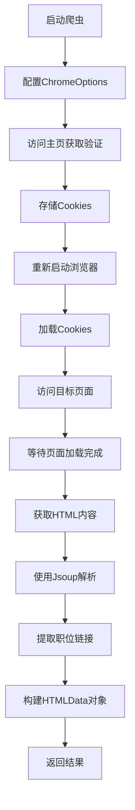
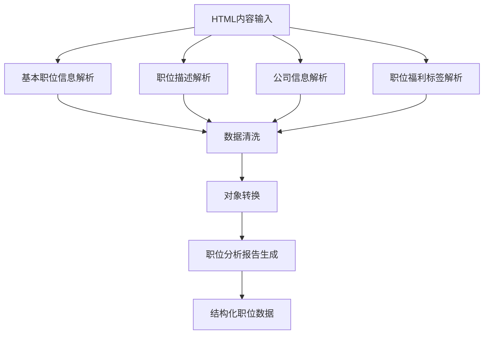
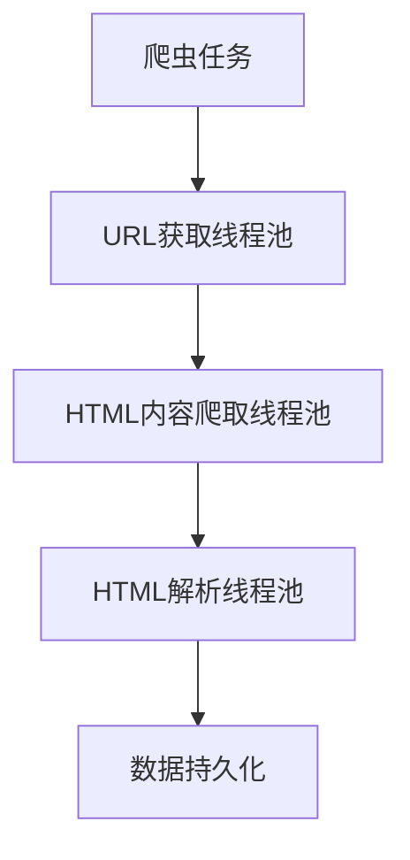
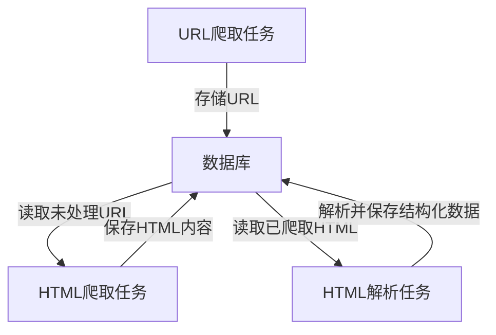
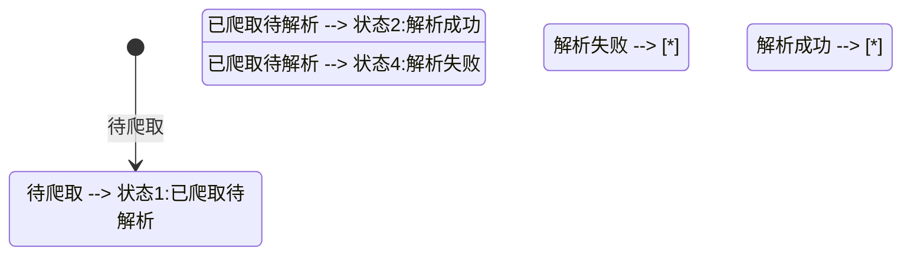

# 数据采集

准备爬取Boss直聘的数据 ，需要对Boss直聘的网站结构 ， http路由结果进行分析

## 数据分析

### 1. http路由分析


首页有意义的数据并不多 ， 我们直接关注搜索页面的数据 ，他的http组成为`https://www.zhipin.com/web/geek/job?city=101010100&position=100101`,在你多流量几个不同的搜索页面下，http会变的固定数据是`city`,`position`,这将是我们批量爬取数据的重要参数。

### 2. 路由参数来源分析


对于这种`city`,`position`的数据 ， 我们可以分析一下它的来源 ，在断网的时候 ， 数据依旧能完整的显示 ， 说明数据一定是缓存在浏览器的 ， 我们打开开发者工具去查看一下 ， 发现数据是某一个json数据。

- City数据
  

- Position数据
  
  > 数据来源同理 ， 请自行去查找

### 路由组成分析

- 搜索结果的页面一定是以`https://www.zhipin.com/web/geek/job?city=101010100&position=100101`的形式，其中`city`和`position`是路由参数，它们分别表示城市和职位。
- 拆分出来baseUrl为`https://www.zhipin.com/web/geek/job?`我们只需要关注`city`和`position`

### 3. 数据库设计

获取到了文件数据源 ， 我们将数据源写入数据库中持久化存储，以便于后续使用。(省略写入数据库的代码)，下面是对数据源格式设计的表结构

```sql
CREATE TABLE `city_data` (
  `id` int NOT NULL AUTO_INCREMENT COMMENT '自增ID，主键',
  `name` varchar(50) CHARACTER SET utf8mb4 COLLATE utf8mb4_general_ci NOT NULL COMMENT '城市名称',
  `code` int NOT NULL COMMENT '城市代码（唯一）',
  `url` varchar(255) CHARACTER SET utf8mb4 COLLATE utf8mb4_general_ci NOT NULL COMMENT '城市URL路径',
  PRIMARY KEY (`id`),
  UNIQUE KEY `code` (`code`),
  KEY `code_2` (`code`)
) ENGINE=InnoDB AUTO_INCREMENT=2612 DEFAULT CHARSET=utf8mb4 COLLATE=utf8mb4_general_ci;

CREATE TABLE `position_data` (
  `id` int NOT NULL AUTO_INCREMENT COMMENT '唯一标识ID',
  `parent_id` varchar(50) CHARACTER SET utf8mb4 COLLATE utf8mb4_unicode_ci NOT NULL COMMENT '父级职位的code值，构建层级关系',
  `code` varchar(50) CHARACTER SET utf8mb4 COLLATE utf8mb4_unicode_ci NOT NULL COMMENT '职位唯一编码',
  `name` varchar(50) CHARACTER SET utf8mb4 COLLATE utf8mb4_unicode_ci NOT NULL COMMENT '职位名称',
  `type` varchar(50) CHARACTER SET utf8mb4 COLLATE utf8mb4_unicode_ci NOT NULL COMMENT '职位类型',
  PRIMARY KEY (`id`)
) ENGINE=InnoDB AUTO_INCREMENT=2451 DEFAULT CHARSET=utf8mb4 COLLATE=utf8mb4_unicode_ci COMMENT='职位数据表，支持层级结构';

CREATE TABLE `industry_data` (
  `id` int NOT NULL AUTO_INCREMENT COMMENT '唯一标识ID',
  `parent_id` varchar(50) CHARACTER SET utf8mb4 COLLATE utf8mb4_unicode_ci NOT NULL COMMENT '父级职位的code值，构建层级关系',
  `code` varchar(50) CHARACTER SET utf8mb4 COLLATE utf8mb4_unicode_ci NOT NULL COMMENT '职位唯一编码',
  `name` varchar(50) CHARACTER SET utf8mb4 COLLATE utf8mb4_unicode_ci NOT NULL COMMENT '职位名称',
  `type` varchar(50) CHARACTER SET utf8mb4 COLLATE utf8mb4_unicode_ci NOT NULL COMMENT '职位类型',
  PRIMARY KEY (`id`),
  UNIQUE KEY `unique_code_type` (`code`,`type`),
  KEY `idx_parent_id` (`parent_id`) COMMENT 'parent_id索引，优化层级查询',
  CONSTRAINT `fk_parent` FOREIGN KEY (`parent_id`) REFERENCES `industry_data` (`code`)
) ENGINE=InnoDB AUTO_INCREMENT=3863 DEFAULT CHARSET=utf8mb4 COLLATE=utf8mb4_unicode_ci COMMENT='职位数据表，支持层级结构';
```

> **industry是与position类似的数据结构是路由的另一种组成方式，可有可无，这里就不再赘述**

## 数据爬取

### 爬虫设计与实现逻辑分析

在对Boss直聘网站进行数据爬取时，我们面临着几个主要挑战：

1. **反爬虫机制的绕过**：Boss直聘网站采用了多种反爬虫措施，包括请求频率限制、IP封禁、验证码校验等。
2. **动态渲染内容的获取**：网站大量使用JavaScript动态渲染页面内容，普通HTTP请求无法获取完整的DOM结构。
3. **登录状态的维护**：某些页面内容需要登录状态才能查看完整信息。
4. **多页面数据的批量获取**：需要按城市、职位等条件批量获取多个页面的数据。

针对这些挑战，我们设计了以下爬虫策略：

#### 1. 技术选型

- **Selenium + ChromeDriver**：使用Selenium控制Chrome浏览器进行页面访问，可以完整执行JavaScript，获取动态渲染后的页面内容。
- **无头浏览器模式**：支持在无GUI环境下运行，适合服务器部署。
- **Jsoup解析库**：用于解析获取到的HTML内容，提取所需数据。

#### 2. 反爬虫应对策略

- **随机延时**：在请求间添加随机时间间隔(5-30秒)，模拟人类浏览行为。
- **Cookie管理**：获取并保存验证后的Cookie，用于后续请求。
- **用户代理伪装**：设置真实的User-Agent，避免被识别为爬虫。
- **自动验证处理**：检测并点击验证按钮，为手动验证预留时间。
- **浏览器指纹隐藏**：通过`--disable-blink-features=AutomationControlled`选项隐藏Selenium自动化特征。

#### 3. 数据获取流程



#### 4. 核心功能模块

- **初始化配置**：读取驱动路径和浏览器配置参数
- **URL构建**：根据城市、职位等参数构建目标URL
- **验证处理**：检测并处理验证码页面
- **数据提取**：解析HTML，提取职位链接和相关信息
- **详情获取**：访问每个职位链接，获取详细信息
- **数据存储**：将HTML内容保存到本地文件或数据库

#### 5. 异常处理与容错机制

- **驱动检查**：启动前验证ChromeDriver是否存在且可执行
- **验证异常捕获**：捕获验证页面处理中可能出现的异常
- **资源释放**：使用try-finally确保浏览器实例在任何情况下都能被关闭
- **异常日志**：详细记录爬取过程中的异常，便于问题排查

#### 6. 性能与资源优化

- **无头模式**：默认使用无头模式减少资源消耗
- **禁用GPU**：通过`--disable-gpu`参数减少不必要的资源占用
- **安全沙箱禁用**：在可信环境中通过`--no-sandbox`提升性能
- **共享内存优化**：通过`--disable-dev-shm-usage`解决内存限制问题

#### 7. 并发与扩展性考虑

虽然当前实现是单线程的，但设计上考虑了后续的并发扩展：

- 方法设计为无状态，支持多线程调用
- 参数完全外部化，便于批处理或分布式执行
- 结果以对象形式返回，便于后续处理管道集成

```java
package com.david.hlp.Spring.boss.service;

import lombok.extern.slf4j.Slf4j;
import org.jsoup.Jsoup;
import org.jsoup.nodes.Document;
import org.jsoup.select.Elements;
import org.openqa.selenium.By;
import org.openqa.selenium.Cookie;
import org.openqa.selenium.WebDriver;
import org.openqa.selenium.WebElement;
import org.openqa.selenium.chrome.ChromeDriver;
import org.openqa.selenium.chrome.ChromeOptions;
import org.openqa.selenium.support.ui.ExpectedConditions;
import org.openqa.selenium.support.ui.WebDriverWait;
import org.springframework.stereotype.Service;
import org.springframework.beans.factory.annotation.Value;

import com.david.hlp.Spring.boss.entity.HTMLData;

import jakarta.annotation.PostConstruct;
import java.io.File;
import java.io.FileWriter;
import java.io.IOException;
import java.time.Duration;
import java.time.LocalDateTime;
import java.time.format.DateTimeFormatter;
import java.util.ArrayList;
import java.util.List;
import java.util.Random;
import java.util.Set;
@Service
@Slf4j
public class WebCrawlerService {

    @Value("${webdriver.chrome.driver:/home/david/Driver/chromedriver-linux64/chromedriver}")
    private String chromeDriverPath;

    @Value("${webdriver.chrome.headless:true}")
    private boolean headless;

    @Value("${webdriver.chrome.disable-gpu:true}")
    private boolean disableGpu;

    @Value("${webdriver.chrome.no-sandbox:true}")
    private boolean noSandbox;

    @Value("${webdriver.chrome.disable-dev-shm-usage:true}")
    private boolean disableDevShmUsage;

    @PostConstruct
    public void initChromeDriver() {
        // 验证ChromeDriver是否存在
        File driverFile = new File(chromeDriverPath);
        if (!driverFile.exists() || !driverFile.canExecute()) {
            log.error("ChromeDriver不存在或无法执行: {}", chromeDriverPath);
            return;
        }
        System.setProperty("webdriver.chrome.driver", chromeDriverPath);
        log.info("ChromeDriver初始化成功，路径: {}", chromeDriverPath);
    }

    /**
     * Boss直聘基础URL
     */
    private static final String RES_URL = "https://www.zhipin.com/web/geek/job?";
    /**
     * Boss直聘域名URL
     */
    private static final String END_URL = "https://www.zhipin.com";
    /**
     * 随机数生成器
     */
    private final Random random = new Random();
    /**
     * 服务初始化
     */
    @PostConstruct
    public void init() {
        log.info("WebCrawlerService初始化完成");
    }
    /**
     * 使用Selenium获取目标URL的HTML数据
     *
     * @param baseType 类型，"position"表示按职位，其他值表示按行业
     * @param baseCityCode 城市代码
     * @param basePositionCode 职位或行业代码
     * @param baseCity 城市名称
     * @param basePosition 职位或行业名称
     * @param baseIndex 页码
     * @return HTML数据对象列表
     */
    public List<HTMLData> getUrlWithSelenium(String baseType, String baseCityCode,
                                      String basePositionCode, String baseCity,
                                      String basePosition, int baseIndex) {
        String baseUrl;
        if ("position".equals(baseType)) {
            baseUrl = RES_URL + "city=" + baseCityCode + "&position=" + basePositionCode + "&page=" + baseIndex;
        } else {
            baseUrl = RES_URL + "city=" + baseCityCode + "&industry=" + basePositionCode + "&page=" + baseIndex;
        }
        log.info("爬虫启动，URL: {}，城市: {}，职位: {}，页码: {}", baseUrl, baseCity, basePosition, baseIndex);
        List<HTMLData> resList = new ArrayList<>();
        WebDriver driver = null;
        try {
            // System.setProperty("webdriver.chrome.driver", "/home/david/Driver/chromedriver-linux64/chromedriver");
            // 配置ChromeOptions
            ChromeOptions options = getConfiguredChromeOptions();
            // 启动浏览器
            driver = new ChromeDriver(options);
            driver.get(END_URL);
            // 检查并处理验证按钮
            try {
                log.info("检查验证按钮");
                WebDriverWait wait = new WebDriverWait(driver, Duration.ofSeconds(10));
                WebElement verifyButton = wait.until(
                    ExpectedConditions.elementToBeClickable(By.cssSelector("button[ka='validate_button_click']"))
                );
                verifyButton.click();
                log.info("验证按钮已点击");
                sleep((long)(random.nextDouble() * 25000 + 5000));  // 等待5-30秒手动完成验证
            } catch (Exception e) {
                log.info("未发现验证页面");
            }
            // 获取Cookies
            Set<Cookie> cookies = driver.manage().getCookies();
            // 关闭浏览器并重新启动以加载Cookies
            driver.quit();
            log.info("浏览器已关闭，准备重启并加载Cookies");
            sleep((long)(random.nextDouble() * 25000 + 5000));  // 等待5-30秒
            driver = new ChromeDriver(options);
            driver.get(END_URL);
            // 添加cookies
            for (Cookie cookie : cookies) {
                driver.manage().addCookie(cookie);
            }
            // 访问目标页面
            log.info("访问目标页面");
            driver.get(baseUrl);
            sleep((long)(random.nextDouble() * 25000 + 5000));  // 等待5-30秒页面加载完成
            String html = driver.getPageSource();
            // 使用Jsoup解析HTML内容
            Document document = Jsoup.parse(html);
            Elements linkElements = document.select("a.job-card-left");
            log.info("找到{}个职位链接", linkElements.size());
            for (int i = 0; i < linkElements.size(); i++) {
                String url = linkElements.get(i).attr("href");
                // 处理相对URL
                if (url.startsWith("/")) {
                    url = END_URL + url.split("\\?")[0];  // 生成完整的职位URL
                }
                HTMLData htmlData = HTMLData.builder()
                        .url(url)
                        .baseCity(baseCity)
                        .basePosition(basePosition)
                        .baseCityCode(baseCityCode)
                        .basePositionCode(basePositionCode)
                        .htmlContent("")
                        .build();
                resList.add(htmlData);
            }
            log.info("共返回{}条数据", resList.size());
            return resList;
        } catch (Exception e) {
            log.error("爬虫执行发生错误: {}", e.getMessage());
            if (log.isDebugEnabled()) {
                log.debug("异常详情:", e);
            }
            return resList;
        } finally {
            // 确保浏览器关闭
            if (driver != null) {
                driver.quit();
            }
        }
    }
    /**
     * 休眠指定时间
     *
     * @param millis 休眠时间(毫秒)
     */
    private void sleep(long millis) {
        try {
            Thread.sleep(millis);
        } catch (InterruptedException e) {
            Thread.currentThread().interrupt();
            log.debug("线程休眠被中断");
        }
    }
    /**
     * 获取职位详情页面HTML内容
     *
     * @param htmlData 包含目标URL的HTML数据对象
     * @return 添加了HTML内容的HTML数据对象
     */
    public HTMLData getHtmlContent(HTMLData htmlData) {
        log.info("获取页面内容: {}", htmlData.getUrl());
        WebDriver driver = null;
        try {
            // 设置ChromeDriver路径
            System.setProperty("webdriver.chrome.driver", chromeDriverPath);
            // 第一次启动浏览器（用于获取验证后的Cookies）
            ChromeOptions options = getConfiguredChromeOptions();
            driver = new ChromeDriver(options);
            log.info("访问Boss直聘主页进行验证");
            driver.get(END_URL);
            // 等待手动验证完成
            sleep((long)(random.nextDouble() * 25000 + 5000));  // 预留5-30秒手动验证时间
            // 获取Cookies
            Set<Cookie> cookies = driver.manage().getCookies();
            // 关闭并重新启动浏览器，加载Cookies
            driver.quit();
            sleep((long)(random.nextDouble() * 25000 + 5000));
            // 重新启动浏览器并加载Cookies
            driver = new ChromeDriver(options);
            driver.get(END_URL);
            for (Cookie cookie : cookies) {
                driver.manage().addCookie(cookie);
            }
            // 访问目标职位页面并获取HTML
            log.info("访问目标职位页面: {}", htmlData.getUrl());
            driver.get(htmlData.getUrl());
            sleep((long)(random.nextDouble() * 25000 + 5000));  // 页面加载等待5-30秒
            String html = driver.getPageSource();
            htmlData.setHtmlContent(html);
            log.info("页面获取成功: {}", htmlData.getUrl());
        } catch (Exception e) {
            log.error("获取页面{}时发生错误: {}", htmlData.getUrl(), e.getMessage());
            if (log.isDebugEnabled()) {
                log.debug("异常详情:", e);
            }
        } finally {
            // 确保浏览器关闭
            if (driver != null) {
                driver.quit();
                log.debug("WebDriver已关闭");
            }
        }
        return htmlData;
    }

    /**
     * 保存HTML内容到本地文件
     *
     * @param htmlContent HTML内容
     * @param fileName 文件名，若为空则使用时间戳生成
     * @param directory 保存目录，默认为当前目录
     * @return 保存的文件路径
     */
    public String saveHtmlToFile(String htmlContent, String fileName, String directory) {
        if (htmlContent == null || htmlContent.isEmpty()) {
            log.error("HTML内容为空，无法保存");
            return null;
        }
        try {
            // 确保目录存在
            String dir = directory == null || directory.isEmpty() ? "./" : directory;
            File dirFile = new File(dir);
            if (!dirFile.exists()) {
                boolean mkdirResult = dirFile.mkdirs();
                if (!mkdirResult) {
                    log.error("创建目录失败: {}", dir);
                    return null;
                }
            }
            // 生成文件名
            String finalFileName;
            if (fileName == null || fileName.isEmpty()) {
                // 使用时间戳作为文件名
                String timestamp = LocalDateTime.now().format(DateTimeFormatter.ofPattern("yyyyMMddHHmmss"));
                finalFileName = "html_" + timestamp + ".html";
            } else {
                // 确保文件名有.html后缀
                finalFileName = fileName.endsWith(".html") ? fileName : fileName + ".html";
            }
            // 完整文件路径
            String filePath = dir + (dir.endsWith("/") ? "" : "/") + finalFileName;
            File file = new File(filePath);
            // 写入文件
            try (FileWriter writer = new FileWriter(file)) {
                writer.write(htmlContent);
                log.info("HTML内容已保存到文件: {}", filePath);
                return filePath;
            }
        } catch (IOException e) {
            log.error("保存HTML内容到文件时发生错误: {}", e.getMessage());
            if (log.isDebugEnabled()) {
                log.debug("异常详情:", e);
            }
            return null;
        }
    }

    /**
     * 获取已配置的ChromeOptions
     * 
     * @return 配置好的ChromeOptions对象
     */
    private ChromeOptions getConfiguredChromeOptions() {
        ChromeOptions options = new ChromeOptions();
        if (headless) {
            options.addArguments("--headless");
        }
        if (disableGpu) {
            options.addArguments("--disable-gpu");
        }
        if (noSandbox) {
            options.addArguments("--no-sandbox");
        }
        if (disableDevShmUsage) {
            options.addArguments("--disable-dev-shm-usage");
        }
        options.addArguments("--disable-blink-features=AutomationControlled");
        options.addArguments("user-agent=Mozilla/5.0 (Windows NT 10.0; Win64; x64) AppleWebKit/537.36 (KHTML, like Gecko) Chrome/87.0.4280.88 Safari/537.36");
        return options;
    }
}
```

## HtmlETL分析

### HTML解析设计与实现逻辑分析

在完成职位列表页和详情页HTML的爬取后，需要对收集到的HTML内容进行解析和结构化处理，以便于后续的数据分析和展示。HTML解析是整个数据处理流程中的关键环节，它将非结构化的HTML转换为结构化的职位数据对象。

#### 1. 解析架构设计

HTML解析服务采用多级解析策略，将复杂的解析任务分解为以下几个主要步骤：

1. **HTML文档解析**：使用Jsoup库将原始HTML字符串解析为DOM文档对象
2. **元素选择与提取**：通过CSS选择器定位并提取关键信息元素
3. **数据清洗与规范化**：清除HTML标签、处理特殊字符、标准化数据格式
4. **对象映射与转换**：将提取的数据映射到业务对象模型
5. **数据增强与分析**：基于提取的基础信息生成额外的分析结果

#### 2. 关键技术点

- **选择器策略**：使用多级选择器和备选选择器策略，确保在页面结构变化时依然能够提取关键信息
  
  ```java
  // 公司名称提取示例：尝试多个可能的位置
  Element companyNameElement = doc.selectFirst(".sider-company .company-info a");
  if (companyNameElement == null) {
    companyNameElement = doc.selectFirst(".job-detail-company .level-list .company-name");
    // 继续尝试其他可能的位置...
  }
  ```

- **容错处理**：每个解析步骤都有独立的异常捕获，确保部分解析失败不会影响整体流程
  
  ```java
  try {
    // 解析逻辑
  } catch (Exception e) {
    log.error("解析出错: {}", e.getMessage());
    // 提供合理的默认值或备选方案
  }
  ```

- **日志追踪**：详细的日志记录，包括解析开始、过程中的关键步骤和解析结果，便于问题排查

- **数据清洗**：专门的清洗环节处理HTML标签、空白字符和特殊字符，确保数据质量
  
  ```java
  String text = html.replaceAll("<br>|<br/>|<br />", "\n")
                  .replaceAll("<[^>]*>", "")
                  .replaceAll(" ", " ")
                  // 更多清洗规则...
  ```

#### 3. 主要功能模块

解析服务主要包含以下核心功能模块：



- **基本职位信息解析**：提取职位名称、薪资范围、工作城市、经验要求等基本信息
- **职位描述解析**：解析职位职责和任职要求，提取关键技能标签
- **公司信息解析**：提取公司名称、规模、融资阶段、所属行业等信息
- **职位福利标签解析**：提取职位福利标签，如"五险一金"、"年终奖"等
- **数据清洗**：清除HTML标签、去重、规范化数据格式
- **对象转换**：将Map形式的解析结果转换为强类型的业务对象
- **职位分析报告生成**：基于解析数据生成薪资分析、技能需求分析、行业分析和福利分析

#### 4. 数据分析策略

在基础数据提取之外，解析服务还实现了数据增强和分析功能：

- **薪资分析**：解析薪资范围，计算平均值和年化收入，评估薪资水平
- **技能需求分析**：从职位描述中提取关键技能要求，分析学历和经验要求
- **行业分析**：基于公司所属行业，评估行业发展前景和增长率
- **福利分析**：对职位福利进行分类和评级，分为保险类、奖金类、工作生活平衡类等

#### 5. 性能与可靠性考虑

- **懒加载处理**：部分计算密集型分析任务采用按需生成策略
- **默认值处理**：对可能为空的字段提供合理默认值，增强解析结果的稳定性
- **降级策略**：当特定解析逻辑失败时，提供替代解析方案或降级处理

#### 6. 可扩展性设计

解析服务的设计考虑了后续功能扩展的需求：

- **模块化设计**：各个解析功能相互独立，可单独扩展或修改
- **分析规则可配置**：分析规则如技能关键词、行业前景评估等可外部配置
- **结果缓存**：支持将解析结果缓存，避免重复解析，提高性能

```java
package com.david.hlp.Spring.boss.service;

import org.jsoup.Jsoup;
import org.jsoup.nodes.Document;
import org.jsoup.nodes.Element;
import org.jsoup.select.Elements;
import org.springframework.stereotype.Service;
import lombok.extern.slf4j.Slf4j;
import com.david.hlp.Spring.boss.model.BasicJobInfo;
import com.david.hlp.Spring.boss.model.BenefitsAnalysis;
import com.david.hlp.Spring.boss.model.CompanyInfo;
import com.david.hlp.Spring.boss.model.IndustryAnalysis;
import com.david.hlp.Spring.boss.model.JobAnalysisReport;
import com.david.hlp.Spring.boss.model.JobDescriptionInfo;
import com.david.hlp.Spring.boss.model.JobDetailData;
import com.david.hlp.Spring.boss.model.SalaryAnalysis;
import com.david.hlp.Spring.boss.model.SkillRequirements;

import java.io.IOException;
import java.util.ArrayList;
import java.util.HashMap;
import java.util.List;
import java.util.Map;
import java.util.LinkedHashSet;

/**
 * 职位详情页HTML解析服务
 */
@Service
@Slf4j
public class HtmlParserService {

    /**
     * 解析职位详情HTML字符串
     *
     * @param htmlContent HTML内容字符串
     * @return 包含职位信息的JobDetailData对象
     * @throws IOException 解析异常
     */
    public JobDetailData parseJobDetail(String htmlContent) throws IOException {
        log.info("开始解析职位详情HTML");
        if (htmlContent == null || htmlContent.isEmpty()) {
            log.error("HTML内容为空，无法解析");
            throw new IllegalArgumentException("HTML内容不能为空");
        }

        try {
            Map<String, Object> result = new HashMap<>();

            Document doc = Jsoup.parse(htmlContent);
            log.debug("HTML解析为Document对象成功");

            // 提取更新时间
            Element updateTimeElement = doc.selectFirst(".gray");
            if (updateTimeElement != null) {
                String updateTimeText = updateTimeElement.text();
                String updateTime = updateTimeText.replace("页面更新时间：", "").trim();
                result.put("updateTime", updateTime);
                log.debug("更新时间解析完成: {}", updateTime);
            } else {
                log.warn("未找到更新时间元素");
            }

            // 1. 解析基本职位信息
            Map<String, String> basicInfo = parseBasicInfo(doc);
            result.put("basicInfo", basicInfo);
            log.debug("基本职位信息解析完成");

            // 2. 解析职位描述和要求
            Map<String, Object> jobDescription = parseJobDescription(doc);
            result.put("jobDescription", jobDescription);
            log.debug("职位描述和要求解析完成");

            // 3. 解析公司信息
            Map<String, String> companyInfo = parseCompanyInfo(doc);
            result.put("companyInfo", companyInfo);
            log.debug("公司信息解析完成");

            // 4. 解析职位福利标签
            List<String> tags = parseJobTags(doc);
            result.put("jobTags", tags);
            log.debug("职位福利标签解析完成");

            // 5. 清洗数据
            cleanData(result);
            log.debug("数据清洗完成");

            // 6. 转换为JobDetailData对象
            JobDetailData jobDetailData = convertToJobDetailData(result);
            log.info("职位详情HTML解析完成");
            return jobDetailData;
        } catch (Exception e) {
            log.error("解析职位详情HTML时发生错误: {}", e.getMessage(), e);
            throw new IOException("解析职位详情失败", e);
        }
    }

    /**
     * 解析基本职位信息
     */
    private Map<String, String> parseBasicInfo(Document doc) {
        log.debug("开始解析基本职位信息");
        Map<String, String> basicInfo = new HashMap<>();

        try {
            // 职位名称
            Element jobNameElement = doc.selectFirst(".job-primary .name h1");
            if (jobNameElement != null) {
                basicInfo.put("positionName", jobNameElement.text());
            } else {
                log.warn("未找到职位名称元素");
            }

            // 薪资范围
            Element salaryElement = doc.selectFirst(".job-primary .name .salary");
            if (salaryElement != null) {
                basicInfo.put("salary", salaryElement.text());
            } else {
                log.warn("未找到薪资范围元素");
            }

            // 工作城市
            Element cityElement = doc.selectFirst(".text-city");
            if (cityElement != null) {
                basicInfo.put("city", cityElement.text());
            } else {
                log.warn("未找到工作城市元素");
            }

            // 工作经验要求
            Element experienceElement = doc.selectFirst(".text-experiece");
            if (experienceElement != null) {
                basicInfo.put("experience", experienceElement.text());
            } else {
                log.warn("未找到工作经验要求元素");
            }

            // 学历要求
            Element degreeElement = doc.selectFirst(".text-degree");
            if (degreeElement != null) {
                basicInfo.put("degree", degreeElement.text());
            } else {
                log.warn("未找到学历要求元素");
            }

            // 工作地址
            Element addressElement = doc.selectFirst(".location-address");
            if (addressElement != null) {
                basicInfo.put("address", addressElement.text());
            } else {
                log.warn("未找到工作地址元素");
            }
        } catch (Exception e) {
            log.error("解析基本职位信息时发生错误: {}", e.getMessage(), e);
        }

        log.debug("基本职位信息解析结果: {}", basicInfo);
        return basicInfo;
    }

    /**
     * 解析职位描述和要求
     */
    private Map<String, Object> parseJobDescription(Document doc) {
        log.debug("开始解析职位描述和要求");
        Map<String, Object> jobDescription = new HashMap<>();

        try {
            // 获取职位描述文本
            Element descElement = doc.selectFirst(".job-sec-text");
            if (descElement != null) {
                String fullText = descElement.html();

                // 分析职位描述文本，提取任职要求和岗位职责
                if (fullText.contains("任职要求")) {
                    String[] parts = fullText.split("岗位职责");

                    if (parts.length > 0) {
                        String requirements = parts[0].replace("任职要求：", "").trim();
                        jobDescription.put("requirements", requirements);
                    }

                    if (parts.length > 1) {
                        String responsibilities = parts[1].trim();
                        jobDescription.put("responsibilities", responsibilities);
                    }
                } else {
                    jobDescription.put("fullDescription", fullText);
                    log.debug("未找到标准的任职要求和岗位职责分隔，使用完整描述");
                }
            } else {
                log.warn("未找到职位描述元素");
            }

            // 关键词标签
            Elements keywordElements = doc.select(".job-keyword-list li");
            List<String> keywords = new ArrayList<>();
            for (Element element : keywordElements) {
                keywords.add(element.text());
            }
            jobDescription.put("keywords", keywords);
        } catch (Exception e) {
            log.error("解析职位描述和要求时发生错误: {}", e.getMessage(), e);
        }

        @SuppressWarnings("unchecked")
        List<String> savedKeywords = (List<String>)jobDescription.getOrDefault("keywords", new ArrayList<>());
        log.debug("职位描述和要求解析结果: 包含关键词{}个", savedKeywords.size());
        return jobDescription;
    }

    /**
     * 解析公司信息
     */
    private Map<String, String> parseCompanyInfo(Document doc) {
        log.debug("开始解析公司信息");
        Map<String, String> companyInfo = new HashMap<>();

        try {
            // 公司名称
            Element companyNameElement = doc.selectFirst(".sider-company .company-info a");
            if (companyNameElement != null) {
                companyInfo.put("companyName", companyNameElement.text());
            } else {
                // 尝试从其他位置获取公司名称
                Element altCompanyNameElement = doc.selectFirst(".job-detail-company .level-list .company-name");
                if (altCompanyNameElement != null) {
                    String companyName = altCompanyNameElement.text().replace("公司名称", "").trim();
                    companyInfo.put("companyName", companyName);
                } else {
                    // 再尝试从职位标题区域获取
                    Element titleCompanyElement = doc.selectFirst(".company-info");
                    if (titleCompanyElement != null) {
                        companyInfo.put("companyName", titleCompanyElement.text().trim());
                    } else {
                        log.warn("未能从任何位置找到公司名称");
                    }
                }
            }

            // 公司融资阶段
            Element financeElement = doc.selectFirst(".sider-company p:has(.icon-stage)");
            if (financeElement != null) {
                companyInfo.put("financingStage", financeElement.text());
            }

            // 公司规模
            Element scaleElement = doc.selectFirst(".sider-company p:has(.icon-scale)");
            if (scaleElement != null) {
                companyInfo.put("companySize", scaleElement.text());
            }

            // 公司所属行业
            Element industryElement = doc.selectFirst(".sider-company p:has(.icon-industry) a");
            if (industryElement != null) {
                companyInfo.put("industry", industryElement.text());
            }

            // 公司介绍
            Element introElement = doc.selectFirst(".job-detail-company .fold-text");
            if (introElement != null) {
                companyInfo.put("companyIntro", introElement.text());
            }

            // 工商信息
            Elements businessInfoElements = doc.select(".level-list li");
            for (Element element : businessInfoElements) {
                Element spanElement = element.selectFirst("span");
                if (spanElement != null) {
                    String key = spanElement.text();
                    String value = element.text().replace(key, "").trim();

                    switch (key) {
                        case "公司名称":
                            companyInfo.put("legalCompanyName", value);
                            if (companyInfo.get("companyName") == null || companyInfo.get("companyName").isEmpty()) {
                                companyInfo.put("companyName", value);
                            }
                            break;
                        case "法定代表人":
                            companyInfo.put("legalRepresentative", value);
                            break;
                        case "成立日期":
                            companyInfo.put("establishDate", value);
                            break;
                        case "企业类型":
                            companyInfo.put("companyType", value);
                            break;
                        case "经营状态":
                            companyInfo.put("operationStatus", value);
                            break;
                        case "注册资金":
                            companyInfo.put("registeredCapital", value);
                            break;
                        default:
                            log.debug("未处理的公司信息字段: {}", key);
                            break;
                    }
                }
            }
        } catch (Exception e) {
            log.error("解析公司信息时发生错误: {}", e.getMessage(), e);
        }

        log.debug("公司信息解析结果: {}", companyInfo.get("companyName"));
        return companyInfo;
    }

    /**
     * 解析职位福利标签
     */
    private List<String> parseJobTags(Document doc) {
        log.debug("开始解析职位福利标签");
        List<String> tags = new ArrayList<>();

        try {
            // 只获取第一个出现的标签组，避免重复
            Elements tagElements = doc.select(".job-tags");
            if (!tagElements.isEmpty()) {
                Element firstTagElement = tagElements.first();
                if (firstTagElement != null) {
                    Elements spanElements = firstTagElement.select("span");
                    for (Element element : spanElements) {
                        tags.add(element.text());
                    }
                }
            } else {
                log.warn("未找到职位福利标签元素");
            }
        } catch (Exception e) {
            log.error("解析职位福利标签时发生错误: {}", e.getMessage(), e);
        }

        log.debug("职位福利标签解析结果: {}个标签", tags.size());
        return tags;
    }

    /**
     * 清洗解析得到的数据
     *
     * @param data 解析得到的原始数据
     */
    private void cleanData(Map<String, Object> data) {
        log.debug("开始清洗解析数据");
        try {
            // 1. 清洗职位描述中的HTML标签
            Object jobDescObj = data.get("jobDescription");
            if (jobDescObj instanceof Map) {
                @SuppressWarnings("unchecked")
                Map<String, Object> jobDescription = (Map<String, Object>) jobDescObj;
                if (jobDescription.containsKey("requirements")) {
                    String requirements = (String) jobDescription.get("requirements");
                    jobDescription.put("requirements", cleanHtmlTags(requirements));
                }

                if (jobDescription.containsKey("responsibilities")) {
                    String responsibilities = (String) jobDescription.get("responsibilities");
                    jobDescription.put("responsibilities", cleanHtmlTags(responsibilities));
                }

                if (jobDescription.containsKey("fullDescription")) {
                    String fullDescription = (String) jobDescription.get("fullDescription");
                    jobDescription.put("fullDescription", cleanHtmlTags(fullDescription));
                }
            }

            // 2. 去除职位福利标签的重复
            Object jobTagsObj = data.get("jobTags");
            if (jobTagsObj instanceof List) {
                @SuppressWarnings("unchecked")
                List<String> jobTags = (List<String>) jobTagsObj;
                if (!jobTags.isEmpty()) {
                    int beforeSize = jobTags.size();
                    data.put("jobTags", new ArrayList<>(new LinkedHashSet<>(jobTags)));
                    @SuppressWarnings("unchecked")
                    List<String> deduplicatedTags = (List<String>) data.get("jobTags");
                    int afterSize = deduplicatedTags.size();
                    if (beforeSize != afterSize) {
                        log.debug("移除了{}个重复的职位福利标签", beforeSize - afterSize);
                    }
                }
            }

            // 3. 确保公司名称不为空
            Object companyInfoObj = data.get("companyInfo");
            if (companyInfoObj instanceof Map) {
                @SuppressWarnings("unchecked")
                Map<String, String> companyInfo = (Map<String, String>) companyInfoObj;
                if (companyInfo.get("companyName") == null || companyInfo.get("companyName").isEmpty()) {
                    if (companyInfo.containsKey("legalCompanyName") && companyInfo.get("legalCompanyName") != null) {
                        companyInfo.put("companyName", companyInfo.get("legalCompanyName"));
                        log.debug("使用法定公司名称替代空的公司名称");
                    } else {
                        log.warn("公司名称为空且无法从法定名称获取");
                    }
                }
            }
        } catch (Exception e) {
            log.error("清洗数据时发生错误: {}", e.getMessage(), e);
        }
    }

    /**
     * 清除HTML标签，保留纯文本内容
     *
     * @param html 包含HTML标签的文本
     * @return 纯文本内容
     */
    private String cleanHtmlTags(String html) {
        if (html == null || html.isEmpty()) {
            return "";
        }

        try {
            // 替换常见HTML标签
            String text = html.replaceAll("<br>|<br/>|<br />", "\n")
                              .replaceAll("<[^>]*>", "")
                              .replaceAll(" ", " ")
                              .replaceAll("\\s+", " ")
                              .trim();

            // 处理可能的转义字符
            text = text.replaceAll("<", "<")
                       .replaceAll(">", ">")
                       .replaceAll("&", "&");

            return text;
        } catch (Exception e) {
            log.error("清除HTML标签时发生错误: {}", e.getMessage(), e);
            return html; // 返回原始文本作为备选
        }
    }

    /**
     * 将Map格式的数据转换为JobDetailData对象
     *
     * @param data 解析得到的Map数据
     * @return JobDetailData对象
     */
    private JobDetailData convertToJobDetailData(Map<String, Object> data) {
        log.debug("开始将Map数据转换为JobDetailData对象");
        JobDetailData jobDetailData = new JobDetailData();
        try {
            // 设置更新时间
            String updateTime = (String) data.get("updateTime");
            if (updateTime != null) {
                jobDetailData.setUpdateTime(updateTime);
                log.debug("设置更新时间: {}", updateTime);
            }

            // 转换基本信息
            Object basicInfoObj = data.get("basicInfo");
            if (basicInfoObj instanceof Map) {
                @SuppressWarnings("unchecked")
                Map<String, String> basicInfoMap = (Map<String, String>) basicInfoObj;
                BasicJobInfo basicInfo = new BasicJobInfo();
                basicInfo.setPositionName(basicInfoMap.get("positionName"));
                basicInfo.setSalary(basicInfoMap.get("salary"));
                basicInfo.setCity(basicInfoMap.get("city"));
                basicInfo.setExperience(basicInfoMap.get("experience"));
                basicInfo.setDegree(basicInfoMap.get("degree"));
                basicInfo.setAddress(basicInfoMap.get("address"));
                jobDetailData.setBasicInfo(basicInfo);
                log.debug("基本信息转换完成: 职位名称={}", basicInfo.getPositionName());
            } else {
                log.warn("基本信息为空，无法转换");
            }

            // 转换职位描述
            Object jobDescObj = data.get("jobDescription");
            if (jobDescObj instanceof Map) {
                @SuppressWarnings("unchecked")
                Map<String, Object> jobDescMap = (Map<String, Object>) jobDescObj;
                if (jobDescMap != null) {
                    JobDescriptionInfo jobDesc = new JobDescriptionInfo();
                    jobDesc.setRequirements((String) jobDescMap.get("requirements"));
                    jobDesc.setResponsibilities((String) jobDescMap.get("responsibilities"));
                    jobDesc.setFullDescription((String) jobDescMap.get("fullDescription"));
                    Object keywordsObj = jobDescMap.get("keywords");
                    if (keywordsObj instanceof List) {
                        @SuppressWarnings("unchecked")
                        List<String> keywords = (List<String>) keywordsObj;
                        jobDesc.setKeywords(keywords);
                    }
                    jobDetailData.setJobDescription(jobDesc);
                    log.debug("职位描述转换完成");
                }
            }

            // 转换公司信息
            Object companyInfoObj = data.get("companyInfo");
            if (companyInfoObj instanceof Map) {
                @SuppressWarnings("unchecked")
                Map<String, String> companyInfoMap = (Map<String, String>) companyInfoObj;
                if (companyInfoMap != null) {
                    CompanyInfo companyInfo = new CompanyInfo();
                    companyInfo.setCompanyName(companyInfoMap.get("companyName"));
                    companyInfo.setFinancingStage(companyInfoMap.get("financingStage"));
                    companyInfo.setCompanySize(companyInfoMap.get("companySize"));
                    companyInfo.setIndustry(companyInfoMap.get("industry"));
                    companyInfo.setCompanyIntro(companyInfoMap.get("companyIntro"));
                    companyInfo.setLegalCompanyName(companyInfoMap.get("legalCompanyName"));
                    companyInfo.setLegalRepresentative(companyInfoMap.get("legalRepresentative"));
                    companyInfo.setEstablishDate(companyInfoMap.get("establishDate"));
                    companyInfo.setCompanyType(companyInfoMap.get("companyType"));
                    companyInfo.setOperationStatus(companyInfoMap.get("operationStatus"));
                    companyInfo.setRegisteredCapital(companyInfoMap.get("registeredCapital"));
                    jobDetailData.setCompanyInfo(companyInfo);
                    log.debug("公司信息转换完成: 公司名称={}", companyInfo.getCompanyName());
                }
            }

            // 设置职位标签
            Object jobTagsObj = data.get("jobTags");
            if (jobTagsObj instanceof List) {
                @SuppressWarnings("unchecked")
                List<String> jobTags = (List<String>) jobTagsObj;
                if (jobTags != null) {
                    jobDetailData.setJobTags(jobTags);
                    log.debug("职位标签设置完成: {}个标签", jobTags.size());
                }
            }
        } catch (Exception e) {
            log.error("转换JobDetailData对象时发生错误: {}", e.getMessage(), e);
        }
        return jobDetailData;
    }

    /**
     * 分析提取的数据，生成职业分析报告
     *
     * @param jobData 解析得到的职位数据
     * @return 包含职业分析报告的JobDetailData对象
     */
    public JobDetailData generateJobAnalysisReport(JobDetailData jobData) {
        log.info("开始生成职业分析报告");
        if (jobData == null) {
            log.error("职位数据为空，无法生成分析报告");
            throw new IllegalArgumentException("职位数据不能为空");
        }

        try {
            JobAnalysisReport report = new JobAnalysisReport();
            // 1. 薪资分析
            BasicJobInfo basicInfo = jobData.getBasicInfo();
            if (basicInfo != null) {
                String salary = basicInfo.getSalary();
                report.setSalaryAnalysis(analyzeSalary(salary));
                log.debug("薪资分析完成: {}", salary);
            } else {
                log.warn("基本信息为空，跳过薪资分析");
            }
            // 2. 技能需求分析
            JobDescriptionInfo jobDescription = jobData.getJobDescription();
            if (jobDescription != null) {
                String requirements = jobDescription.getRequirements();
                report.setSkillRequirements(analyzeSkillRequirements(requirements));
                log.debug("技能需求分析完成");
            } else {
                log.warn("职位描述为空，跳过技能需求分析");
            }
            // 3. 行业分析
            CompanyInfo companyInfo = jobData.getCompanyInfo();
            if (companyInfo != null) {
                String industry = companyInfo.getIndustry();
                report.setIndustryAnalysis(analyzeIndustry(industry));
                log.debug("行业分析完成: {}", industry);
            } else {
                log.warn("公司信息为空，跳过行业分析");
            }
            // 4. 职位福利分析
            List<String> jobTags = jobData.getJobTags();
            if (jobTags != null && !jobTags.isEmpty()) {
                report.setBenefitsAnalysis(analyzeBenefits(jobTags));
                log.debug("职位福利分析完成: {}个福利", jobTags.size());
            } else {
                log.warn("职位福利标签为空，跳过福利分析");
            }
            // 设置分析报告
            jobData.setAnalysisReport(report);
            log.info("职业分析报告生成完成");
        } catch (Exception e) {
            log.error("生成职业分析报告时发生错误: {}", e.getMessage(), e);
        }
        return jobData;
    }

    /**
     * 分析薪资水平
     */
    private SalaryAnalysis analyzeSalary(String salary) {
        log.debug("开始分析薪资水平: {}", salary);
        SalaryAnalysis analysis = new SalaryAnalysis();
        if (salary != null && !salary.isEmpty()) {
            try {
                // 解析薪资范围，例如：12-20K
                String[] range = salary.replaceAll("[^0-9\\-\\.]", "").split("-");
                if (range.length == 2) {
                    try {
                        double min = Double.parseDouble(range[0]);
                        double max = Double.parseDouble(range[1]);
                        double avg = (min + max) / 2;
                        analysis.setMinSalary(min);
                        analysis.setMaxSalary(max);
                        analysis.setAvgSalary(avg);
                        // 按月薪计算年薪（13薪）
                        analysis.setEstimatedAnnualSalary(avg * 13);
                        // 薪资水平分析
                        if (avg > 30) {
                            analysis.setSalaryLevel("高薪");
                        } else if (avg > 15) {
                            analysis.setSalaryLevel("中高薪");
                        } else if (avg > 8) {
                            analysis.setSalaryLevel("中等薪资");
                        } else {
                            analysis.setSalaryLevel("基础薪资");
                        }
                        log.debug("薪资解析结果: 最低{}K, 最高{}K, 平均{}K, 级别: {}", 
                                min, max, avg, analysis.getSalaryLevel());
                    } catch (NumberFormatException e) {
                        log.error("薪资数值解析错误: {}", e.getMessage(), e);
                    }
                } else {
                    log.warn("薪资格式不符合预期: {}", salary);
                }
            } catch (Exception e) {
                log.error("薪资分析时发生错误: {}", e.getMessage(), e);
            }
        } else {
            log.warn("薪资信息为空");
        }
        return analysis;
    }
    /**
     * 分析技能需求
     */
    private SkillRequirements analyzeSkillRequirements(String requirements) {
        log.debug("开始分析技能需求");
        SkillRequirements analysis = new SkillRequirements();
        if (requirements != null && !requirements.isEmpty()) {
            try {
                // 分析学历要求
                if (requirements.contains("硕士") || requirements.contains("研究生")) {
                    analysis.setEducationLevel("硕士及以上");
                } else if (requirements.contains("本科")) {
                    analysis.setEducationLevel("本科");
                } else if (requirements.contains("大专")) {
                    analysis.setEducationLevel("大专");
                } else {
                    analysis.setEducationLevel("不明确");
                }
                log.debug("学历要求分析结果: {}", analysis.getEducationLevel());
                // 分析经验要求
                if (requirements.contains("年以上经验") || requirements.contains("年工作经验")) {
                    // 提取工作经验年限
                    String expText = requirements.replaceAll(".*?(\\d+)年(以上经验|工作经验).*", "$1");
                    try {
                        int years = Integer.parseInt(expText);
                        analysis.setExperienceYears(years);
                        if (years >= 5) {
                            analysis.setExperienceLevel("资深");
                        } else if (years >= 3) {
                            analysis.setExperienceLevel("有经验");
                        } else {
                            analysis.setExperienceLevel("初级");
                        }
                        log.debug("工作经验要求: {}年, 级别: {}", years, analysis.getExperienceLevel());
                    } catch (NumberFormatException e) {
                        log.error("经验年限解析错误: {}", e.getMessage(), e);
                        analysis.setExperienceLevel("有经验要求");
                    }
                } else if (requirements.contains("经验不限") || requirements.contains("无经验要求")) {
                    analysis.setExperienceLevel("经验不限");
                } else {
                    analysis.setExperienceLevel("不明确");
                }
                // 提取关键技能
                List<String> keySkills = new ArrayList<>();
                // 这里可以根据不同行业的职位扩展更多关键词匹配
                String[] commonSkills = {"研究", "分析", "报告", "政策", "调研", "战略", "行业", "金融", "数据", "沟通"};
                for (String skill : commonSkills) {
                    if (requirements.contains(skill)) {
                        keySkills.add(skill);
                    }
                }
                analysis.setKeySkills(keySkills);
                log.debug("关键技能匹配结果: {}个技能", keySkills.size());
            } catch (Exception e) {
                log.error("分析技能需求时发生错误: {}", e.getMessage(), e);
            }
        } else {
            log.warn("需求描述为空，无法分析技能需求");
        }

        return analysis;
    }

    /**
     * 分析行业信息
     */
    private IndustryAnalysis analyzeIndustry(String industry) {
        log.debug("开始分析行业信息: {}", industry);
        IndustryAnalysis analysis = new IndustryAnalysis();

        try {
            analysis.setIndustry(industry);

            // 根据行业分类添加行业发展前景分析
            // 这里可以扩展为连接外部API或数据库获取行业数据
            if (industry != null) {
                if (industry.contains("半导体") || industry.contains("芯片")) {
                    analysis.setOutlook("战略新兴产业，国家重点支持发展方向");
                    analysis.setGrowthRate("高速增长");
                } else if (industry.contains("互联网") || industry.contains("IT")) {
                    analysis.setOutlook("成熟行业，持续发展");
                    analysis.setGrowthRate("稳定增长");
                } else if (industry.contains("金融") || industry.contains("投资")) {
                    analysis.setOutlook("传统支柱行业，稳定发展");
                    analysis.setGrowthRate("稳定");
                } else {
                    analysis.setOutlook("需要进一步分析");
                    analysis.setGrowthRate("未知");
                }
                log.debug("行业分析结果: 前景={}, 增长率={}", analysis.getOutlook(), analysis.getGrowthRate());
            } else {
                log.warn("行业信息为空");
            }
        } catch (Exception e) {
            log.error("分析行业信息时发生错误: {}", e.getMessage(), e);
        }

        return analysis;
    }

    /**
     * 分析职位福利
     */
    private BenefitsAnalysis analyzeBenefits(List<String> benefits) {
        log.debug("开始分析职位福利: {}个福利", benefits != null ? benefits.size() : 0);
        BenefitsAnalysis analysis = new BenefitsAnalysis();

        if (benefits != null && !benefits.isEmpty()) {
            try {
                analysis.setBenefitsCount(benefits.size());
                analysis.setAllBenefits(benefits);

                // 分类福利
                List<String> insuranceRelated = new ArrayList<>();
                List<String> bonusRelated = new ArrayList<>();
                List<String> workLifeBalance = new ArrayList<>();
                List<String> developmentRelated = new ArrayList<>();
                List<String> facilitiesRelated = new ArrayList<>();

                for (String benefit : benefits) {
                    if (benefit.contains("险") || benefit.contains("金") || benefit.contains("医疗")) {
                        insuranceRelated.add(benefit);
                    } else if (benefit.contains("奖") || benefit.contains("分红") || benefit.contains("股")) {
                        bonusRelated.add(benefit);
                    } else if (benefit.contains("假") || benefit.contains("调休") || benefit.contains("弹性")) {
                        workLifeBalance.add(benefit);
                    } else if (benefit.contains("培训") || benefit.contains("晋升") || benefit.contains("发展")) {
                        developmentRelated.add(benefit);
                    } else if (benefit.contains("食") || benefit.contains("宿") || benefit.contains("车") || benefit.contains("网")) {
                        facilitiesRelated.add(benefit);
                    }
                }
                analysis.setInsuranceBenefits(insuranceRelated);
                analysis.setBonusBenefits(bonusRelated);
                analysis.setWorkLifeBalanceBenefits(workLifeBalance);
                analysis.setDevelopmentBenefits(developmentRelated);
                analysis.setFacilitiesBenefits(facilitiesRelated);
                log.debug("福利分类结果: 保险类={}, 奖金类={}, 平衡类={}, 发展类={}, 设施类={}",
                        insuranceRelated.size(), bonusRelated.size(), workLifeBalance.size(),
                        developmentRelated.size(), facilitiesRelated.size());
                // 福利完整度评价
                if (benefits.size() >= 8) {
                    analysis.setBenefitsRating("优秀");
                } else if (benefits.size() >= 5) {
                    analysis.setBenefitsRating("良好");
                } else if (benefits.size() >= 3) {
                    analysis.setBenefitsRating("一般");
                } else {
                    analysis.setBenefitsRating("基础");
                }
                log.debug("福利完整度评价: {}", analysis.getBenefitsRating());
            } catch (Exception e) {
                log.error("分析职位福利时发生错误: {}", e.getMessage(), e);
            }
        } else {
            log.warn("职位福利为空，无法进行分析");
        }
        return analysis;
    }
}
```

## 并发处理与线程池设计

在完成HTML解析后，需要考虑如何高效地并发处理大量的爬取和解析任务。由于爬虫任务具有IO密集型特性，合理的线程池设计对于提高系统性能和资源利用率至关重要。同时，由于爬虫面临的反爬限制，我们需要特别注意并发控制策略。

### 1. 并发处理挑战

爬虫系统并发处理面临以下主要挑战：

1. **反爬虫限制**：目标网站通常对单IP的频繁请求有严格限制，过高的并发可能导致IP被封禁
2. **资源竞争**：多线程环境下对共享资源（网络连接、内存、数据库连接等）的竞争
3. **任务优先级**：不同类型任务（URL爬取、HTML解析、数据入库）的处理优先级不同
4. **异常隔离**：单个任务的异常不应影响整体爬虫系统的稳定运行
5. **Spring上下文共享**：确保异步线程能够正确访问Spring容器管理的服务和组件

### 2. 线程池设计思路

基于上述挑战，我们采用了"单一职责、隔离运行"的线程池设计原则：



将整个爬虫流程分为多个独立阶段，每个阶段使用独立的线程池处理，主要优势：

1. **职责隔离**：每个线程池只负责特定类型的任务，便于针对性优化和监控
2. **速率控制**：可以为不同阶段设置不同的并发级别，例如网络请求限制更严格
3. **资源隔离**：避免一种任务类型耗尽系统资源影响其他任务
4. **故障隔离**：一个线程池的异常不会级联影响其他线程池

### 3. 单线程设计分析

我们针对每种任务类型都设计了**单线程线程池**（核心线程数=最大线程数=1），主要原因：

1. **反爬限制**：没有IP代理池的情况下，单IP并发过高会迅速触发反爬机制，反而降低整体效率
2. **幂等性保证**：单线程处理可以避免并发修改同一资源导致的数据不一致问题
3. **顺序性保证**：某些任务（如同一个页面的分页爬取）需要按特定顺序执行
4. **资源占用可控**：爬虫任务IO等待时间长，过多线程反而会增加资源开销

### 4. 关键配置参数分析

线程池配置参数的选择基于以下考虑：

| 参数     | 配置值              | 选择理由                  |
| ------ | ---------------- | --------------------- |
| 核心线程数  | 1                | 限制并发请求数，避免触发反爬机制      |
| 最大线程数  | 1                | 确保任何情况下都不会创建更多线程      |
| 线程空闲时间 | 0秒               | 保持核心线程始终运行，避免线程创建开销   |
| 工作队列容量 | 100              | 足够缓冲待处理任务，避免任务丢失      |
| 拒绝策略   | CallerRunsPolicy | 队列满时在调用者线程执行任务，起到背压效果 |

### 5. Spring上下文传递设计

为解决异步线程中无法正常访问Spring容器管理的Bean的问题，我们特别设计了`executeWithSpringContext`方法：

```java
public static void executeWithSpringContext(final Runnable task) {
    // 获取当前线程的类加载器
    final ClassLoader contextClassLoader = Thread.currentThread().getContextClassLoader();

    EXECUTOR.execute(() -> {
        // 保存执行线程的原始类加载器
        ClassLoader oldClassLoader = Thread.currentThread().getContextClassLoader();
        try {
            // 设置提交任务线程的类加载器到执行线程
            Thread.currentThread().setContextClassLoader(contextClassLoader);
            // 执行任务
            task.run();
        } finally {
            // 恢复原始类加载器
            Thread.currentThread().setContextClassLoader(oldClassLoader);
        }
    });
}
```

这种设计确保了异步线程能够正确访问Spring容器管理的Bean，是一种轻量级的上下文传递解决方案。

### 6. 监控与管理功能

每个线程池都提供了监控和管理接口，便于实时了解任务执行状态：

- **getActiveCount()**: 获取当前活动线程数
- **getQueueSize()**: 获取等待队列中的任务数量
- **shutdown()**: 优雅关闭线程池
- **awaitTermination()**: 等待所有任务完成

这些接口为爬虫系统提供了必要的监控能力，可以根据任务执行情况动态调整爬取策略。

## 设计线程池

> 由于没有IP代理池 ， 所以单IP下限制线程为1

```java
package com.david.hlp.Spring.common.threadpool;

import java.util.concurrent.ArrayBlockingQueue;
import java.util.concurrent.ThreadFactory;
import java.util.concurrent.ThreadPoolExecutor;
import java.util.concurrent.TimeUnit;
import java.util.concurrent.atomic.AtomicInteger;

/**
 * Boss HTML数据解析专用单线程线程池
 * 只允许一个线程执行任务
 */
public class ParseBossHtmlDataThreadPool {
    /**
     * 线程池单例
     */
    private static final ThreadPoolExecutor EXECUTOR;

    /**
     * 核心线程数
     */
    private static final int CORE_POOL_SIZE = 1;

    /**
     * 最大线程数
     */
    private static final int MAX_POOL_SIZE = 1;

    /**
     * 空闲线程存活时间(秒)
     */
    private static final long KEEP_ALIVE_TIME = 0L;

    /**
     * 任务队列容量
     */
    private static final int QUEUE_CAPACITY = 100;

    static {
        // 自定义线程工厂
        ThreadFactory threadFactory = new ThreadFactory() {
            private final AtomicInteger threadNumber = new AtomicInteger(1);
            @Override
            public Thread newThread(Runnable r) {
                Thread thread = new Thread(r, "html-parser-thread-" + threadNumber.getAndIncrement());
                // 设置为非守护线程
                thread.setDaemon(false);
                return thread;
            }
        };
        EXECUTOR = new ThreadPoolExecutor(
                CORE_POOL_SIZE,
                MAX_POOL_SIZE,
                KEEP_ALIVE_TIME,
                TimeUnit.SECONDS,
                new ArrayBlockingQueue<>(QUEUE_CAPACITY),
                threadFactory,
                new ThreadPoolExecutor.CallerRunsPolicy()
        );
    }

    /**
     * 私有构造函数，防止实例化
     */
    private ParseBossHtmlDataThreadPool() {
    }

    /**
     * 提交任务到线程池
     *
     * @param task 任务
     */
    public static void execute(Runnable task) {
        EXECUTOR.execute(task);
    }

    /**
     * 关闭线程池
     */
    public static void shutdown() {
        if (!EXECUTOR.isShutdown()) {
            EXECUTOR.shutdown();
        }
    }

    /**
     * 使用Spring上下文安全提交任务
     * 保证在异步线程中可以获取Spring上下文
     *
     * @param task 需要执行的任务
     */
    public static void executeWithSpringContext(final Runnable task) {
        // 获取当前线程的类加载器
        final ClassLoader contextClassLoader = Thread.currentThread().getContextClassLoader();

        EXECUTOR.execute(() -> {
            // 保存执行线程的原始类加载器
            ClassLoader oldClassLoader = Thread.currentThread().getContextClassLoader();
            try {
                // 设置提交任务线程的类加载器到执行线程
                Thread.currentThread().setContextClassLoader(contextClassLoader);
                // 执行任务
                task.run();
            } catch (Exception e) {
                // 统一异常处理
                Thread.currentThread().getUncaughtExceptionHandler()
                      .uncaughtException(Thread.currentThread(), e);
            } finally {
                // 恢复原始类加载器
                Thread.currentThread().setContextClassLoader(oldClassLoader);
            }
        });
    }

    /**
     * 等待所有任务完成
     * 
     * @param timeout 超时时间(秒)
     * @return 是否在超时前完成所有任务
     */
    public static boolean awaitTermination(long timeout) {
        try {
            return EXECUTOR.awaitTermination(timeout, TimeUnit.SECONDS);
        } catch (InterruptedException e) {
            Thread.currentThread().interrupt();
            return false;
        }
    }

    /**
     * 获取当前活动线程数
     *
     * @return 活动线程数
     */
    public static int getActiveCount() {
        return EXECUTOR.getActiveCount();
    }

    /**
     * 获取队列中等待执行的任务数
     *
     * @return 等待执行的任务数
     */
    public static int getQueueSize() {
        return EXECUTOR.getQueue().size();
    }

    /**
     * 获取线程池
     *
     * @return 线程池实例
     */
    public static ThreadPoolExecutor getExecutor() {
        return EXECUTOR;
    }
}
```

```java
package com.david.hlp.Spring.common.threadpool;

import java.util.concurrent.ArrayBlockingQueue;
import java.util.concurrent.ThreadFactory;
import java.util.concurrent.ThreadPoolExecutor;
import java.util.concurrent.TimeUnit;
import java.util.concurrent.atomic.AtomicInteger;

/**
 * Boss数据爬取专用单线程线程池
 * 只允许一个线程执行任务
 */
public class ScrapeBossDataThreadPool {
    /**
     * 线程池单例
     */
    private static final ThreadPoolExecutor EXECUTOR;

    /**
     * 核心线程数
     */
    private static final int CORE_POOL_SIZE = 1;

    /**
     * 最大线程数
     */
    private static final int MAX_POOL_SIZE = 1;

    /**
     * 空闲线程存活时间(秒)
     */
    private static final long KEEP_ALIVE_TIME = 0L;

    /**
     * 任务队列容量
     */
    private static final int QUEUE_CAPACITY = 100;

    static {
        // 自定义线程工厂
        ThreadFactory threadFactory = new ThreadFactory() {
            private final AtomicInteger threadNumber = new AtomicInteger(1);

            @Override
            public Thread newThread(Runnable r) {
                Thread thread = new Thread(r, "boss-data-thread-" + threadNumber.getAndIncrement());
                // 设置为非守护线程
                thread.setDaemon(false);
                return thread;
            }
        };

        EXECUTOR = new ThreadPoolExecutor(
                CORE_POOL_SIZE,
                MAX_POOL_SIZE,
                KEEP_ALIVE_TIME,
                TimeUnit.SECONDS,
                new ArrayBlockingQueue<>(QUEUE_CAPACITY),
                threadFactory,
                new ThreadPoolExecutor.CallerRunsPolicy()
        );
    }

    /**
     * 私有构造函数，防止实例化
     */
    private ScrapeBossDataThreadPool() {
    }

    /**
     * 提交任务到线程池
     *
     * @param task 任务
     */
    public static void execute(Runnable task) {
        EXECUTOR.execute(task);
    }

    /**
     * 关闭线程池
     */
    public static void shutdown() {
        if (!EXECUTOR.isShutdown()) {
            EXECUTOR.shutdown();
        }
    }

    /**
     * 使用Spring上下文安全提交任务
     * 保证在异步线程中可以获取Spring上下文
     *
     * @param task 需要执行的任务
     */
    public static void executeWithSpringContext(final Runnable task) {
        // 获取当前线程的类加载器
        final ClassLoader contextClassLoader = Thread.currentThread().getContextClassLoader();

        EXECUTOR.execute(() -> {
            // 保存执行线程的原始类加载器
            ClassLoader oldClassLoader = Thread.currentThread().getContextClassLoader();
            try {
                // 设置提交任务线程的类加载器到执行线程
                Thread.currentThread().setContextClassLoader(contextClassLoader);
                // 执行任务
                task.run();
            } catch (Exception e) {
                // 统一异常处理
                Thread.currentThread().getUncaughtExceptionHandler()
                      .uncaughtException(Thread.currentThread(), e);
            } finally {
                // 恢复原始类加载器
                Thread.currentThread().setContextClassLoader(oldClassLoader);
            }
        });
    }

    /**
     * 等待所有任务完成
     * 
     * @param timeout 超时时间(秒)
     * @return 是否在超时前完成所有任务
     */
    public static boolean awaitTermination(long timeout) {
        try {
            return EXECUTOR.awaitTermination(timeout, TimeUnit.SECONDS);
        } catch (InterruptedException e) {
            Thread.currentThread().interrupt();
            return false;
        }
    }

    /**
     * 获取当前活动线程数
     *
     * @return 活动线程数
     */
    public static int getActiveCount() {
        return EXECUTOR.getActiveCount();
    }

    /**
     * 获取队列中等待执行的任务数
     *
     * @return 等待执行的任务数
     */
    public static int getQueueSize() {
        return EXECUTOR.getQueue().size();
    }

    /**
     * 获取线程池
     *
     * @return 线程池实例
     */
    public static ThreadPoolExecutor getExecutor() {
        return EXECUTOR;
    }
}
```

```java
package com.david.hlp.Spring.common.threadpool;

import java.util.concurrent.ArrayBlockingQueue;
import java.util.concurrent.ThreadFactory;
import java.util.concurrent.ThreadPoolExecutor;
import java.util.concurrent.TimeUnit;
import java.util.concurrent.atomic.AtomicInteger;

/**
 * 网络爬虫专用单线程线程池
 * 只允许一个线程执行任务
 */
public class ScrapeBossUrlThreadPool {
    /**
     * 线程池单例
     */
    private static final ThreadPoolExecutor EXECUTOR;

    /**
     * 核心线程数
     */
    private static final int CORE_POOL_SIZE = 1;

    /**
     * 最大线程数
     */
    private static final int MAX_POOL_SIZE = 1;

    /**
     * 空闲线程存活时间(秒)
     */
    private static final long KEEP_ALIVE_TIME = 0L;

    /**
     * 任务队列容量
     */
    private static final int QUEUE_CAPACITY = 100;

    static {
        // 自定义线程工厂
        ThreadFactory threadFactory = new ThreadFactory() {
            private final AtomicInteger threadNumber = new AtomicInteger(1);

            @Override
            public Thread newThread(Runnable r) {
                Thread thread = new Thread(r, "crawler-thread-" + threadNumber.getAndIncrement());
                // 设置为非守护线程
                thread.setDaemon(false);
                return thread;
            }
        };

        EXECUTOR = new ThreadPoolExecutor(
                CORE_POOL_SIZE,
                MAX_POOL_SIZE,
                KEEP_ALIVE_TIME,
                TimeUnit.SECONDS,
                new ArrayBlockingQueue<>(QUEUE_CAPACITY),
                threadFactory,
                new ThreadPoolExecutor.CallerRunsPolicy()
        );
    }

    /**
     * 私有构造函数，防止实例化
     */
    private ScrapeBossUrlThreadPool() {
    }

    /**
     * 提交任务到线程池
     *
     * @param task 任务
     */
    public static void execute(Runnable task) {
        EXECUTOR.execute(task);
    }

    /**
     * 关闭线程池
     */
    public static void shutdown() {
        if (!EXECUTOR.isShutdown()) {
            EXECUTOR.shutdown();
        }
    }

    /**
     * 使用Spring上下文安全提交任务
     * 保证在异步线程中可以获取Spring上下文
     *
     * @param task 需要执行的任务
     */
    public static void executeWithSpringContext(final Runnable task) {
        // 获取当前线程的类加载器
        final ClassLoader contextClassLoader = Thread.currentThread().getContextClassLoader();

        EXECUTOR.execute(() -> {
            // 保存执行线程的原始类加载器
            ClassLoader oldClassLoader = Thread.currentThread().getContextClassLoader();
            try {
                // 设置提交任务线程的类加载器到执行线程
                Thread.currentThread().setContextClassLoader(contextClassLoader);
                // 执行任务
                task.run();
            } catch (Exception e) {
                // 统一异常处理
                Thread.currentThread().getUncaughtExceptionHandler()
                      .uncaughtException(Thread.currentThread(), e);
            } finally {
                // 恢复原始类加载器
                Thread.currentThread().setContextClassLoader(oldClassLoader);
            }
        });
    }

    /**
     * 等待所有任务完成
     * 
     * @param timeout 超时时间(秒)
     * @return 是否在超时前完成所有任务
     */
    public static boolean awaitTermination(long timeout) {
        try {
            return EXECUTOR.awaitTermination(timeout, TimeUnit.SECONDS);
        } catch (InterruptedException e) {
            Thread.currentThread().interrupt();
            return false;
        }
    }

    /**
     * 获取当前活动线程数
     *
     * @return 活动线程数
     */
    public static int getActiveCount() {
        return EXECUTOR.getActiveCount();
    }
    /**
     * 获取队列中等待执行的任务数
     *
     * @return 等待执行的任务数
     */
    public static int getQueueSize() {
        return EXECUTOR.getQueue().size();
    }

    /**
     * 获取线程池
     *
     * @return 线程池实例
     */
    public static ThreadPoolExecutor getExecutor() {
        return EXECUTOR;
    }
}
```

## 定时任务

### 定时任务设计与实现分析

在完成线程池设计后，我们需要考虑如何调度和管理爬虫任务的执行。定时任务是一种有效的方式，可以按照预定的时间间隔自动执行爬取和处理任务，实现数据的持续更新。

#### 1. 整体架构设计

数据爬取系统采用分层架构设计，将整个爬取流程分为三个独立但相互衔接的阶段：



这种分层设计带来几个主要优势：

1. **解耦合**：各阶段独立执行，互不干扰
2. **容错性**：单阶段失败不影响整体流程
3. **可追踪**：通过数据状态可以清晰追踪处理进度
4. **可扩展**：各阶段可以独立扩展和优化

#### 2. 调度策略设计

调度策略基于以下考虑：

| 任务类型   | 调度频率  | 执行时间窗口     | 设计理由             |
| ------ | ----- | ---------- | ---------------- |
| URL爬取  | 每30分钟 | 8:00-18:00 | 工作时间是职位数据更新的高峰期  |
| HTML爬取 | 每30分钟 | 8:00-18:00 | 分散请求压力，避免频繁请求    |
| HTML解析 | 每30分钟 | 8:00-18:00 | 与爬取任务错开执行，平衡系统负载 |

目前代码中配置的是1分钟间隔的`fixedDelay`，这是为了开发测试目的，实际生产环境应使用注释中的`cron`表达式。

#### 3. 状态管理策略

HTMLData实体的状态字段用于跟踪处理进度，状态流转如下：



这种状态设计确保：

1. 每条数据只被处理一次
2. 失败的任务可被识别和重试
3. 系统可以跟踪整体处理进度

#### 4. 事务与异常处理

异常处理遵循"捕获细粒度、处理粗粒度"原则：

```
try {
    // 主要业务逻辑
} catch (特定异常类型 e) {
    // 特定异常处理
    数据状态更新为失败(4)
} catch (Exception e) {
    // 通用异常处理
    数据状态更新为失败(4)
}
```

关键设计点：

- HTML解析任务使用`@Transactional`注解确保数据一致性
- 每个处理步骤都有独立的异常捕获，避免级联失败
- 异常后数据状态更新，确保任务可追踪和重试
- 详细的日志记录，便于问题定位

#### 5. 并发控制与资源管理

定时任务与线程池结合使用，形成"定时调度、并发执行"的模式：

1. **定时触发**：Spring的`@Scheduled`注解定时启动任务
2. **并发执行**：任务内部使用专用线程池处理
3. **资源控制**：每次处理有限数据（`listByStatus(1, 10)`）
4. **执行隔离**：不同类型任务使用独立线程池

这种设计在保证系统稳定性的同时，提供了足够的处理效率。

#### 6. 关键流程与性能优化

1. **随机化选择**：URL爬取任务随机选择城市和职位，避免单一路径重复爬取
2. **批量处理**：每次处理固定数量（10条）数据，避免单次处理过多
3. **随机延时**：在任务之间添加随机延时（1-5分钟），模拟人类行为
4. **增量式更新**：通过URL去重机制，避免重复爬取已有数据
5. **懒加载解析**：HTML内容存储后再解析，而非爬取同时解析

```java
package com.david.hlp.Spring.boss.service;

import org.springframework.stereotype.Component;
import org.springframework.transaction.annotation.Transactional;

import com.david.hlp.Spring.boss.entity.CityData;
import com.david.hlp.Spring.boss.entity.PositionData;
import com.david.hlp.Spring.boss.mapper.CityDataMapper;
import com.david.hlp.Spring.boss.mapper.HtmlDataMapper;
import com.david.hlp.Spring.boss.mapper.PositionDataMapper;
import com.david.hlp.Spring.boss.entity.HTMLData;
import lombok.RequiredArgsConstructor;
import com.david.hlp.Spring.boss.model.JobDetailData;
import com.david.hlp.Spring.boss.entity.JobDetailEntity;
import com.david.hlp.Spring.boss.mapper.JobDetailEntityMapper;
import com.david.hlp.Spring.common.threadpool.ScrapeBossUrlThreadPool;
import com.david.hlp.Spring.common.threadpool.ScrapeBossDataThreadPool;
import com.david.hlp.Spring.common.threadpool.ParseBossHtmlDataThreadPool;
import org.springframework.scheduling.annotation.Scheduled;
import java.util.List;
import java.util.Random;
import java.io.IOException;
import org.springframework.dao.DuplicateKeyException;
import lombok.extern.slf4j.Slf4j;
import com.fasterxml.jackson.databind.ObjectMapper;
import org.springframework.dao.DataIntegrityViolationException;
import jakarta.annotation.PostConstruct;
@Slf4j
@Component
@RequiredArgsConstructor
public class DataScrapingService {
    private final CityDataMapper cityDataMapper;
    private final PositionDataMapper positionDataMapper;
    private final HtmlDataMapper htmlDataMapper;
    private final HtmlParserService htmlParserService;
    private final WebCrawlerService webCrawlerService;
    private final JobDetailEntityMapper jobDetailEntityMapper;
    private final Random random = new Random();
    private final ObjectMapper objectMapper = new ObjectMapper();

    @PostConstruct
    public void init() {
        log.info("初始化数据爬取服务");
        scrapeBossUrl();
    }

        /**
     * 休眠指定时间
     *
     * @param millis 休眠时间(毫秒)
     */
    private void sleep(long millis) {
        try {
            Thread.sleep(millis);
        } catch (InterruptedException e) {
            Thread.currentThread().interrupt();
            log.debug("线程休眠被中断");
        }
    }

    /**
     * 使用线程池爬取Boss网站的URL
     * 每30分钟执行一次，在上午8点到晚上6点之间
     */
    // 运行间隔30分钟
    @Scheduled(fixedDelay = 1000 * 60 * 1)
    // @Scheduled(cron = "0 */30 8-18 * * *")
    public void scrapeBossUrl() {
        ScrapeBossUrlThreadPool.executeWithSpringContext(() -> {
            List<CityData> cityDataList = cityDataMapper.listAll();
            List<PositionData> positionDataList = positionDataMapper.listAll();
            if (cityDataList.isEmpty() || positionDataList.isEmpty()) {
                return;
            }
            CityData randomCity = cityDataList.get(random.nextInt(cityDataList.size()));
            PositionData randomPosition = positionDataList.get(random.nextInt(positionDataList.size()));
            for (int i = 0; i < 10; i++) {
                log.info("开始爬取Boss网站URL: {}", randomCity.getName() + " " + randomPosition.getName());
                List<HTMLData> htmlDataList = webCrawlerService.getUrlWithSelenium(
                    "position",
                    randomCity.getCode().toString(),
                    randomPosition.getCode().toString(),
                    randomCity.getName(),
                    randomPosition.getName(),
                    i
                );
                for (HTMLData htmlData : htmlDataList) {
                    try {
                        // 先检查URL是否已存在
                        HTMLData existingData = htmlDataMapper.getByUrl(htmlData.getUrl());
                        if (existingData != null) {
                            log.info("URL已存在，跳过插入: {}", htmlData.getUrl());
                            continue;
                        }
                        htmlDataMapper.insert(htmlData);
                        log.debug("成功插入HTML数据，URL: {}", htmlData.getUrl());
                    } catch (DuplicateKeyException e) {
                        // 捕获重复键异常，记录日志但不中断处理
                        log.info("URL重复，跳过插入: {}", htmlData.getUrl());
                    } catch (Exception e) {
                        // 捕获其他异常
                        log.error("插入HTML数据时发生错误，URL: {}，错误: {}", htmlData.getUrl(), e.getMessage());
                    }
                }
                sleep((long)(random.nextDouble() * 240000 + 60000));
            }
        });
    }

    /**
     * 使用线程池爬取Boss网站的数据
     * 每20分钟执行一次，在上午8点到晚上6点之间
     */
    // 运行间隔30分钟
    @Scheduled(fixedDelay = 1000 * 60 * 1)
    // @Scheduled(cron = "0 */30 8-18 * * *")
    public void scrapeBossData() {
        ScrapeBossDataThreadPool.executeWithSpringContext(() -> {
            List<HTMLData> htmlDataList = htmlDataMapper.listByStatus(0, 10);
            for (HTMLData htmlData : htmlDataList) {
                try {
                    log.info("开始爬取Boss网站数据: {}", htmlData.getUrl());
                    htmlData = webCrawlerService.getHtmlContent(htmlData);
                    htmlData.setStatus(1);
                    htmlDataMapper.update(htmlData);
                    sleep((long)(random.nextDouble() * 240000 + 60000));
                } catch (Exception e) {
                    log.error("爬取Boss网站数据时发生错误: {}", e.getMessage());
                }
            }
        });
    }

    /**
     * 使用线程池解析Boss HTML数据
     * 每30分钟执行一次，在上午8点到晚上6点之间
     */
    @Transactional
    // 运行间隔30分钟
    @Scheduled(fixedDelay = 1000 * 60 * 1)
    // @Scheduled(cron = "0 */30 8-18 * * *")
    public void parseBossHtmlData() {
        ParseBossHtmlDataThreadPool.executeWithSpringContext(() -> {
            List<HTMLData> htmlDataList = htmlDataMapper.listByStatus(1, 10);
            for (HTMLData htmlData : htmlDataList) {
                try {
                    // 解析HTML内容获取职位详情数据
                    JobDetailData jobDetailData;
                    try {
                        log.info("开始解析HTML内容: {}", htmlData.getUrl());
                        jobDetailData = htmlParserService.parseJobDetail(htmlData.getHtmlContent());
                    } catch (IOException e) {
                        log.error("解析HTML内容失败: {}, URL: {}", e.getMessage(), htmlData.getUrl());
                        htmlData.setStatus(4); // 标记为处理失败
                        htmlDataMapper.update(htmlData);
                        continue;
                    }
                    // 使用ObjectMapper将JobDetailData对象转换为JSON字符串
                    String detailDataJson;
                    try {
                        detailDataJson = objectMapper.writeValueAsString(jobDetailData);
                    } catch (Exception e) {
                        log.error("无法将JobDetailData转换为JSON: {}", e.getMessage());
                        // 设置为有效的JSON对象，避免插入失败
                        detailDataJson = "{}";
                    }
                    JobDetailEntity jobDetailEntity = JobDetailEntity.builder()
                        .positionId(htmlData.getBasePositionCode())
                        .companyId(htmlData.getBaseCityCode())
                        .positionName(htmlData.getBasePosition())
                        .companyName(htmlData.getBaseCity())
                        .detailData(detailDataJson)
                        .build();
                    jobDetailEntityMapper.insert(jobDetailEntity);
                    // 更新HTML数据状态为已处理
                    htmlData.setStatus(2);
                    htmlDataMapper.update(htmlData);
                    log.info("成功处理HTML数据，URL: {}", htmlData.getUrl());
                } catch (DataIntegrityViolationException e) {
                    log.error("数据完整性错误，无法保存职位详情: {}", e.getMessage());
                    // 将此记录标记为处理失败
                    htmlData.setStatus(4);
                    htmlDataMapper.update(htmlData);
                } catch (Exception e) {
                    log.error("处理HTML数据时发生错误: {}", e.getMessage());
                    if (log.isDebugEnabled()) {
                        log.debug("异常详情:", e);
                    }
                    // 将此记录标记为处理失败
                    htmlData.setStatus(4);
                    htmlDataMapper.update(htmlData);
                }
            }
        });
    }
}
```

> 以上省略所有数据库操作

# 数据库操作

内容过多我就不一一展示  ， 在数据已经完全获取的情况下 ， 如何去构建数据格式都行。自由发挥


# Maxwell监听数据库变化传输个kafka结果

