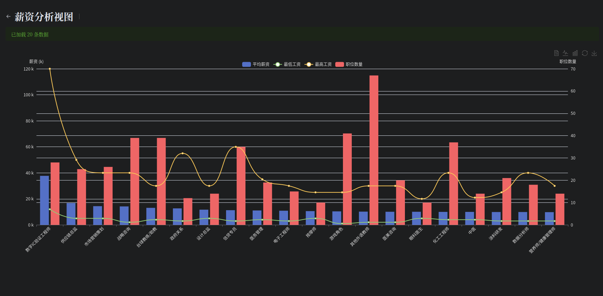
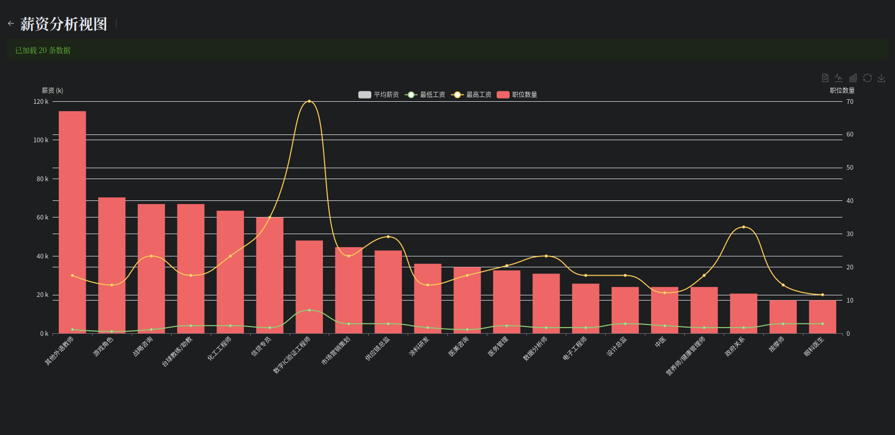
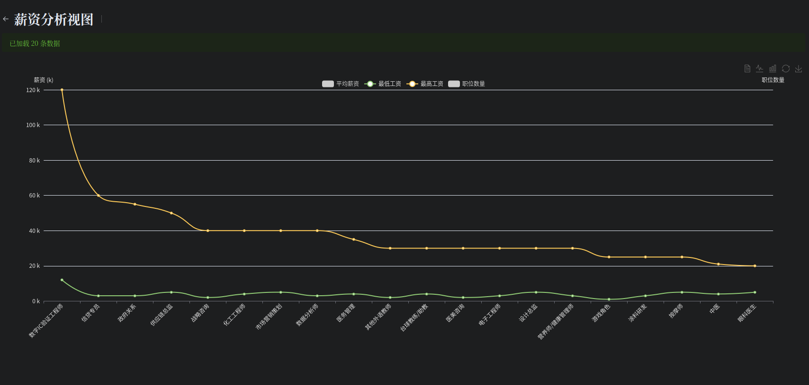
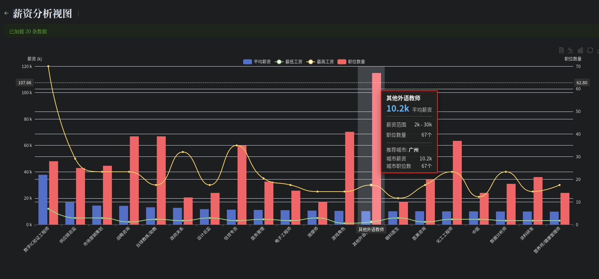
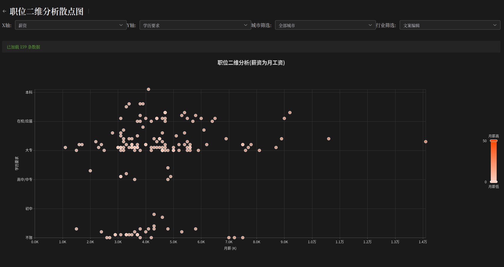
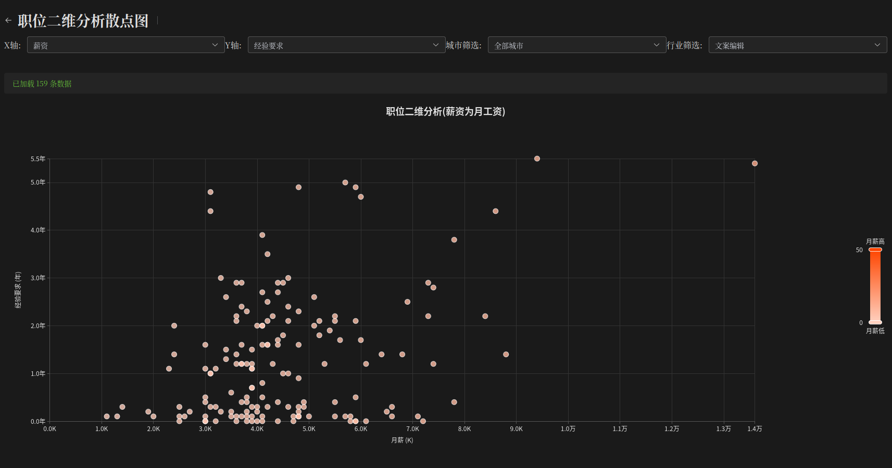
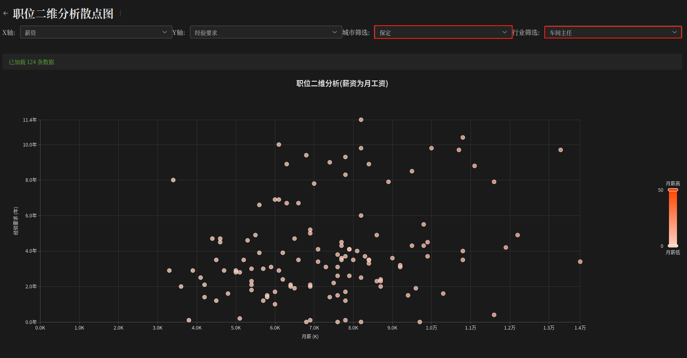
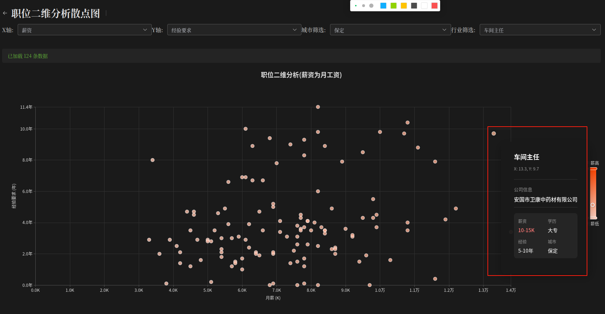
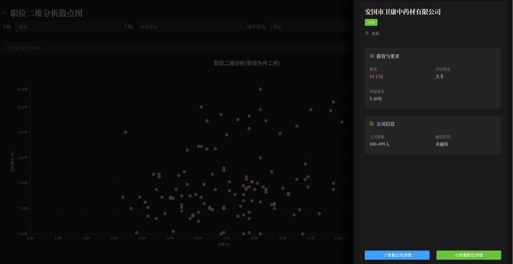

# 求职者板块

- `version 1.0.0`

> 项目处于开发中，会持续更新内容

## 功能概述

求职者板块是本系统的核心模块之一，主要为求职者提供职位数据分析和可视化服务，帮助用户更好地了解就业市场情况，做出更明智的求职决策。

目前已实现的功能：

- [x] 薪资分析视图
- [x] 职位二维分析散点图
- [ ] 职位推荐系统
- [ ] 简历优化建议
- [ ] 面试准备指南

## 薪资分析视图

薪资分析视图提供多维度的薪资数据可视化，帮助求职者全面了解不同职位、城市的薪资水平。

### 数据排序规则

视图默认排序优先级：平均薪资 > 职位数量 > 最高薪资 > 最低薪资

### 功能详解

#### 平均薪资视图

显示不同职位类别或城市的平均薪资水平，以柱状图形式呈现，直观反映薪资差异。用户可以快速识别高薪行业和地区。

#### 职位数量视图

展示各职位类别或城市的招聘职位数量，反映就业市场需求热度。职位数量是衡量就业机会多少的重要指标。

#### 最高薪资视图

展示各职位类别或城市能达到的最高薪资水平，帮助用户了解职业发展的薪资上限。

#### 最低薪资视图

展示各职位类别或城市的薪资下限，帮助用户了解入行的基本薪资水平。

#### 详细分布视图

以更精细的方式展示薪资分布情况，包含中位数、四分位数等统计指标，全面反映薪资分布特征。

### 使用方法

1. 在顶部筛选栏选择感兴趣的职位类别、城市或其他条件
2. 系统自动根据筛选条件更新各视图数据
3. 点击图表中的数据点可查看更详细信息

## 职位二维分析散点图

职位二维分析散点图通过二维坐标系呈现职位的多维属性关系，帮助用户发现薪资与其他因素之间的关联。

### 坐标轴可选属性

用户可自由选择x轴和y轴的属性：

- 学历要求
- 经验要求
- 薪资水平

### 典型应用场景

#### 薪资与学历关系分析

展示不同学历要求对应的薪资水平，帮助用户了解提升学历可能带来的薪资增长。

#### 薪资与经验关系分析

展示工作经验与薪资的关系，反映职业成长路径和薪资发展趋势。

### 高级筛选功能

系统支持对散点图数据进行精细筛选：

- 可指定职位类别
- 可选择特定城市
- 可设置其他筛选条件

通过这些筛选，用户可以聚焦于特定职业发展路径的分析。

### 单点数据详情

- 鼠标悬停在散点上，可以查看该点的详细信息。

- 鼠标点击散点，可以查看该点的详细信息。

### 使用方法

1. 选择x轴和y轴表示的属性
2. 应用职位、城市等筛选条件
3. 悬停或点击散点可查看详细职位信息
4. 观察散点分布模式，发现属性间关联

## 后续开发计划

我们计划在未来版本中添加以下功能：

- 职位关键词分析工具
- 薪资预测模型
- 个性化职业发展路径规划
- 行业发展趋势分析
- 竞争力评估系统